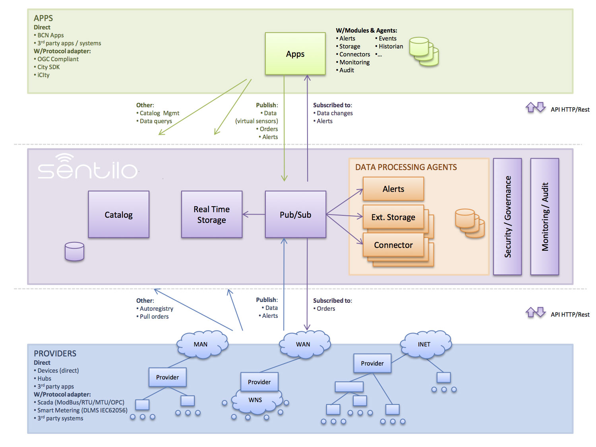
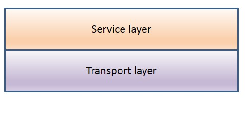
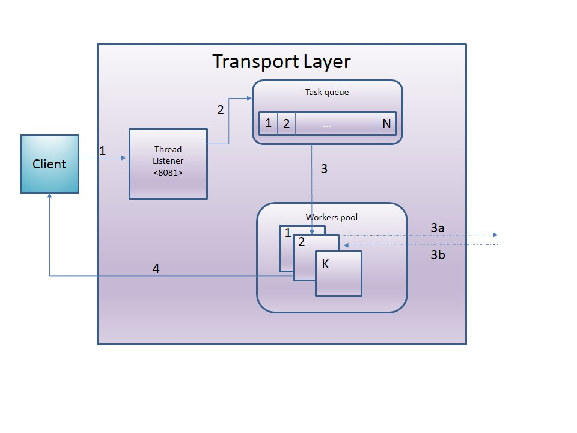
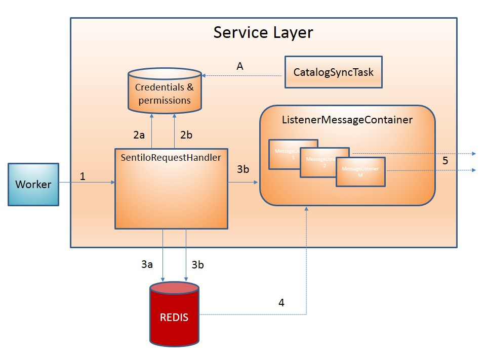

Architecture
============

Sentilo is a platform aimed to isolate and communicate the applications
that are developed to exploit the information generated from the ground
by the layer of sensors deployed across to collect and broadcast this
information.

Its main modules are:

-  Restful API
-  Web Application which provides an administration console and some
   public visualizers
-  Data publication & subscription system
-  A memory database for storing real time data
-  A non-SQL database for storing less volatile data, like the sensor’s
   catalog
-  Several agents which extend the platform features

Key Concepts
~~~~~~~~~~~~

This section describes the main concepts of Sentilo. Many of these
concepts are discussed later deeply.

You can read also some `Technical FAQs <./technical_faq.html>`__.

PubSub Platform
^^^^^^^^^^^^^^^

Sentilo allows customers to publish and retrieve information and to
subscribe to system events. This module is a stand-alone Java process
that uses Redis as a publish/subscribe mechanism.

The different types of information considered are:

-  observations
-  alarms
-  orders

Please, check this out fore more
`info <./api_docs/services/subscription/subscription.html>`__.

RealTime storage
^^^^^^^^^^^^^^^^

Redis is the primary repository where the platform stores all the information
received. It is configured to do periodic backups in the file system. It
is also the Publish/Subscribe engine.

REST API
^^^^^^^^

The client’s communication with publish/subscription mechanism is made
using the REST API provided by the platform.

Services offered by the API can be classified into five main groups:

-  **data**: provides operations to publish, retrieve, delete data.
-  **order**: provides operations to publish, retrieve, delete orders.
-  **alarm**: provides operations to publish, retrieve, delete alarms.
-  **subscribe**: provides operations to subscribe, retrieve and cancel
   subscriptions.
-  **catalog**: provides operations to insert, update, query and delete
   catalog resources (sensors, components and alerts).

By default, the information is transmitted using JSON format. Please,
check this out fore more `info <./api_docs/web_home.html>`__.

Agents
^^^^^^

Agents are Java processes that expand the core functionality of the
platform through a Plug & Play system using the Redis publish and
subscribe mechanism.

Sentilo currently provides several `agents <./integrations.html#agents>`__, for example:

-  **Relational database agent**: used to export historical data to a
   relational database.
-  **Alert agent**: used for processing each data received by the
   platform and validate it with the business rules configured in the
   catalog.
-  **Activity Monitor Agent**: used for upload the events to
   Elasticsearch.
-  **Historian Agent**: used for upload the events to OpenTSDB.

See the complete list here: `Sentilo Agents <./integrations.html#agents>`__

Authentication Token
^^^^^^^^^^^^^^^^^^^^

The invocation of different REST API services is secured using an
authentication token. This token must be sent in every request as a
header parameter of the HTTP request named IDENTITY_KEY. This token is
unique for each provider or client application, and is managed by the
catalog application.

Please, check this out fore more `info <./api_docs/security.html>`__.

Permission
^^^^^^^^^^

Permissions allow Sentilo to identify the requester and to ensure that
who makes a request is authorized to do it. Permissions are managed by
the catalog web app and allow to configure read or write permissions to
client application on third party resources (provider or client
applications). By default, every platform entity has read and write
permissions on its own resources.

Please, check this out fore more `info <./api_docs/security.hml>`__.

Notification mechanism
^^^^^^^^^^^^^^^^^^^^^^

Sentilo provides two mechanisms for notifying events:

-  If the client is capable of having an opened socket, the platform
   will send a notification to this socket every time an event is
   triggered
   (`push <./api_docs/services/subscription/subscription.html>`__).
-  If the client cannot have an opened socket, then it must be doing
   periodic requests (`polling <./api_docs/services/data/data.html>`__)
   to the platform to retrieve last events.

Catalog
^^^^^^^

The Web Application Platform console allows to manage the following
resources: providers, applications, components, sensors, sensors types,
component types, alerts and users.

It also provides a public console for displaying components and sensors
registered in the platform as well as the data that has been received.

Please, check this out fore more `info <./catalog_and_maps.html>`__.

Alert
^^^^^

Sentilo allows to manage sensor-level internal alerts, aimed to control
the validity of the data received. The set of conditional operators
available are: **>, >=, <, <=, =, any change, variation, frozen**. When
the value received from a sensor doesn't met any of the conditions
defined, the alert agent publishes an event (alarm) notifying it. These
alerts are defined through the `console <./catalog_and_maps.html>`__.
There are also external alerts which can be defined and triggered
externally though the
`API <./api_docs/services/alert/create_alerts.html>`__.

Platform architecture
~~~~~~~~~~~~~~~~~~~~~

The following diagram describes the Sentilo platform:

PubSub Server
^^^^^^^^^^^^^

PubSub Server is a stand-alone java application whose design is divided
into two layers:

-  Transport Layer: designed following the Thread Pool pattern:
   http://en.wikipedia.org/wiki/Thread_pool_pattern
-  Service Layer: Based in Spring and Redis, it’s designed to provide
   high performance rates.

Transport Layer
'''''''''''''''

The transport layer is designed following the Thread Pool pattern and
is implemented with Apache HttpCore library.

The following diagram shows the main flow for a request within this
layer:

-  The client sends a Http request to the REST platform
-  The server accepts and queues it on the list of pending requests
-  When a Worker is available, a pending task is assigned to it for
   processing (removing it from the queue)

   -  delegates the request to an element of the service layer
   -  and constructs the HTTP response from the information received

-  Send the response to client’s request

The values ​​of the job queue and the workers’ pool are fully
configurable via properties file, for easily adjust to the load
requirements of each environment:

.. code:: xml

   <bean id="ThreadPool" class="org.sentilo.platform.server.pool.ThreadPool"
         p:initialCapacity="${thread.pool.capacity.initial}"
         p:maxCapacity="${thread.pool.capacity.max}"
         p:shutdownSecondsTimeout="${thread.pool.shutdown.timeout.seconds}"
         p:QUEUESIZE="${thread.pool.queue.size}"
         p:groupId="${thread.pool.group.id}"
         p:groupName="${thread.pool.group.name}" />

.. code:: properties

   thread.pool.queue.size=100
   thread.pool.capacity.initial=4
   thread.pool.capacity.max=10

Service Layer
'''''''''''''

The design of this layer has the main premise of minimizing the request
processing time, so all the main job is held in memory(Redis). Redis
stores data in a memory database but also has the possibility of disk
storage to ensure the durability of the data.

The following diagram shows the main flow for a request within this
layer:

**NOTE:** (*) Executed asynchronously to the main process.

-  The Worker delegates the request to the associated handler depending
   on the type of request (data, order, alarm, …)
-  The following validations are performed on each request:

   -  **(2a)** Integrity of credential: checks the received token sent
      in the header using the internal database in memory containing all
      active credentials in the system.
   -  **(2b)** Authorization to carry out the request: validate that the
      requested action can be done according to the permission database.
   -  the validity of the request parameters: mainly, structure and
      typology.

-  After that:

   -  stores the data in Redis (in memory)
   -  and depending on the type of data

      -  **(3a)** publish the data through publish mechanism
      -  **(3b)** or register of the subscription in the
         ListenerMessageContainer

-  Redis is responsible for sending the published information to
   ListenerMessageContainer event, who is responsible for managing the
   subscription in Redis as a client for any type of event.
-  The container notifies the event to each subscription associated with
   it sending a request, via :literal:`HttpCallback`

The platform registers a task that runs periodically who is responsible
for credentials & permissions synchronization, stored in memory in
server (A). These data is retrieved from the catalog application. This
will maintain anytime an exact copy of these values ​​in memory and
allows to check credentials and permissions instantly.

Finally, access to Redis is done through a connection pool fully
configurable through properties file, which allows you to adjust to the
specifics of each environment.

.. code:: xml

   <bean id="jedisPoolConfig" class="redis.clients.jedis.JedisPoolConfig"
         p:maxActive="${jedis.config.maxactive}"  
         p:maxIdle="${jedis.config.maxidle}" 
         p:maxWait="${jedis.config.maxwait}"  
         p:testOnBorrow="true"
         p:whenExhaustedAction="1"/>

.. code:: properties

   jedis.config.maxactive=50
   jedis.config.maxidle=50
   jedis.config.maxwait=50

Comments
''''''''

-  This design allows system scalability both vertically and
   horizontally:

   -  vertically: increasing the boundaries of work queue & workers.
   -  horizontally: distributing the load across multiple instances or
      server nodes.

-  It also reduce response time because the process is carried out in
   memory.

Catalog application
^^^^^^^^^^^^^^^^^^^

The catalog application platform is a web application built with Spring
on the server side (Spring MVC, Spring Security, ..) using jQuery and
bootstrap as presentation layer and MongoDB as data storage database.

This webapp consists of:

-  a public console for displaying public data of components and sensors
   and their data
-  a secured part for resources management: providers, client apps,
   sensors, components, alerts, permissions, …

It is fully integrated with the Publish/Subscribe platform for data
synchronization:

-  permission and authentication data
-  register statistical data and the latest data received for showing it
   in different graphs of the Web application.
