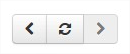
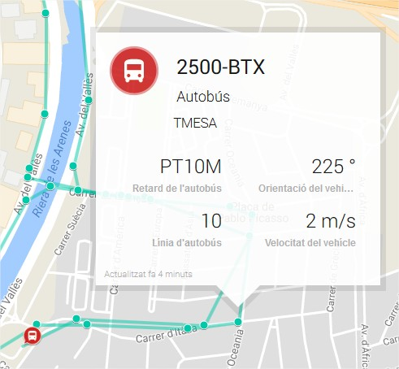

Map Viewers
-----------

In the publicly accessible section of the Catalog, Sentilo offers two different map viewers that display
data in real-time, as they are being published in the system.

Both viewers are accessible from the *Explore* item
at the top menu bar (*Universal viewer* and *Route viewer*).

Universal viewer
~~~~~~~~~~~~~~~~

Components map
^^^^^^^^^^^^^^

The catalog provides a default map, based on Google Maps, which shows
all the public components registered at the platform. If the user is
logged as administrator, all the private components will be displayed as
well.

|universal_viewer_170_001.jpg|

On this page, you can filter the components to show by selecting a
*component type* from the top left select.

|universal_viewer_170_002.jpg|

Depending on the zoom level, the map will display the elements as
individuals POIs or grouped in clusters, showing the number of
components in each group.

|universal_viewer_170_003.jpg|

Component details
^^^^^^^^^^^^^^^^^

Sensors list
''''''''''''

When you select a component, a popup window is opened above the map and
displays the list of sensors related to it with the last activity for
each one of them (as noted above, the private sensors will be displayed
only for logged users):

|universal_viewer_170_004.jpg|

Sensors last activity view
''''''''''''''''''''''''''

If you click into the content area of the popup window, a new page is
open displaying some basic details about the component, and a
time-series graph with the last activity of each of its sensors:

|universal_viewer_190_005.png|

You may also click the bottom-right corner icon |universal_viewer_190_006.png|
and get a page with bigger detail. The URL of this page is shareable, i.e. it is possible to send it by email.

|universal_viewer_190_007.png|

.. _navigate-the-last-data-chart-1:

Navigate the last data chart

You can navigate along the dates of the graph by using the buttons
located in the lower right corner of it:

|chart_controls.png|

-  **left arrow**: navigate to the past (only if there are older data)
-  **reload data (center button)**: reload last data / reset chart data
-  **right arrow**: navigate to the future (only if you have navigated
   or gone into the past before)

Displaying complex data
^^^^^^^^^^^^^^^^^^^^^^^

In some cases, you may want to inform **complex data** as an observation
on Sentilo, such like a large json object. For these cases, Sentilo will
detect that the text is a json object and then it will be shown to you
as a prettify json value:

|complex_data_170_001.jpg|

You can expand or compress the prettified json with the bottom buttons
under the status field,

Route viewer
~~~~~~~~~~~~

As the name suggest, the route viewer is a specific map that shows the
routes followed by the mobile components (keep in mind that only the
last 20 points are displayed for each route):

|route_viewer_170_001.jpg|

The same features described previously apply on this map and its markers
(popup window, … ), but with the particularity that if you click over a
*route point* then the popup window displays sensor activity related to
the time instant in which component was at that location.

|route_viewer_170_002.jpg|

Background map configuration
~~~~~~~~~~~~~~~~~~~~~~~~~~~~

Center and Zoom
^^^^^^^^^^^^^^^

Each Organization can have it's own map center and zoom level.
Please refer to corresponding part in the Administration Console section:
`Organization Map configuration <../administration_console.html#map-configuration>`_

Map Providers
^^^^^^^^^^^^^

For all background maps, you can use either Google or Leaflet map provider. Through the latter you can consume
any OGC WMS/WMTS service that provides a EPSG 3857 SRID.

The configuration of both is in in :literal:`/sentilo-catalog-web/src/main/resources/properties/catalog-config.properties`.

Example of Google Maps configuration

::

   catalog.map.provider=gmaps
   catalog.map.google.key=AIza...

Example of Leaflet maps configuration, using a public Terrestris WMS service:

::

   catalog.map.provider=leaflet
   catalog.map.wms.url=https://ows.terrestris.de/osm/service?
   catalog.map.wms.layers=OSM-WMS
   catalog.map.wms.version=1.3.0
   catalog.map.wms.format=image/jpeg
   catalog.map.wms.attribution=Terrestris
   catalog.map.wms.styles=

|map_provider_190_001.png|

.. note::

   If you insert multiple layers in the *catalog.map.wms.layers* property, a layer selector
   in the bottom-right corner of the map will appear.

.. |universal_viewer_170_002.jpg| image:: ../_static/images/catalog_and_maps/universal_viewer_170_002.jpg

.. |universal_viewer_190_006.png| image:: ../_static/images/catalog_and_maps/universal_viewer_190_006.png

