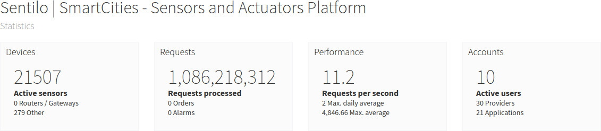
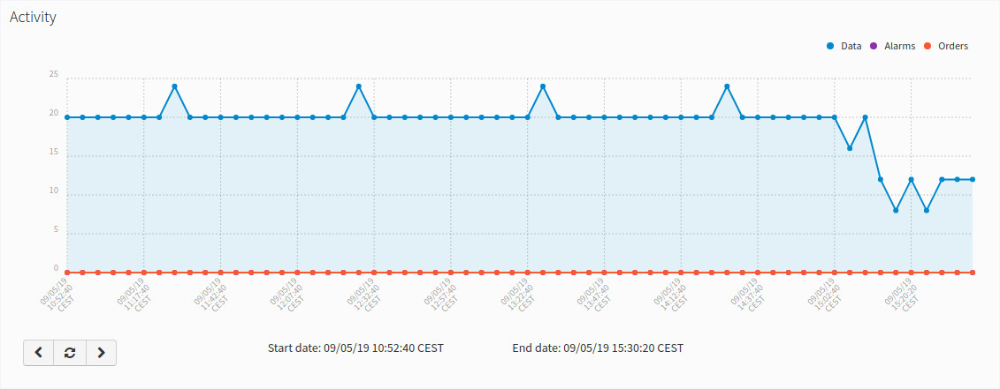
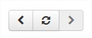

Statistics page
---------------

The public section of the Catalog allows us to display some Sentilo statistics through a set
of features/pages which allow us to inspect the current platform
activity and to display the components/sensors over a map.

The statistic dashboard, which is accessible from the top menu bar,
displays some basic use indicators, like total requests processed,
number of sensors registered, current requests per second, max daily
average and max average requests per second, ….. These values are
automatically updated every 30 seconds.

These values are never being reset, unless you re-create Redis database.

|stats_001.jpg|

It also shows a time-series graph which displays the platform activity
(such as observations, orders and alarms) for the last 100 minutes. This
graph is automatically updated every 5 minutes.

|stats_002.jpg|

Navigate the last data chart
^^^^^^^^^^^^^^^^^^^^^^^^^^^^

.. note::

   You can navigate along the dates of the graph by using the buttons located in the lower right corner of it:
   |chart_controls.png|

   -  **left arrow**: navigate to the past (only if there are older data)
   -  **reload data (center button)**: reload last data / reset chart data
   -  **right arrow**: navigate to the future (only if you have navigated
   or gone into the past before)

