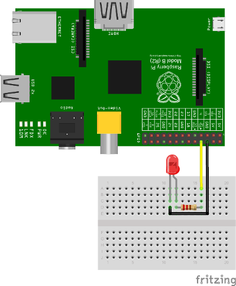

RaspberryPi Client
==================

.. figure:: /_static/images/clients/raspberrypi.jpeg
   :alt: RaspberryPi

The **SentiloClientNodej** is a library written in javascript that
brings to you the possibility to connect any device and embedded device
with Node.js to a Sentilo instance easily.

For this example we’ll use a Raspberry pi device, because its special
features, like cheap price, small dimensions and the great input-output
possiblities.

Hardware
--------

We need some hardware to execute this example:

+-----------------------------------+-----------------------------------+
| Material                          | Description                       |
+-----------------------------------+-----------------------------------+
| **Raspberry Pi**                  | Of course, we need a Raspberry    |
|                                   | Pi, doesn't matters its version.  |
|                                   | You need a Raspbian distro        |
|                                   | installed too                     |
+-----------------------------------+-----------------------------------+
| **Ethernet cable or wifi dongle** | Doesn't matter what network       |
|                                   | hardware do you use, it's up to   |
|                                   | you, but you'll need the correct  |
|                                   | drivers correctly configured for  |
|                                   | connecting to Internet            |
+-----------------------------------+-----------------------------------+
| **Some cables**                   | Some "dupont" male-to-female      |
|                                   | cables to make breadboard         |
|                                   | connections                       |
+-----------------------------------+-----------------------------------+
| **A LED**                         | We'll use a LED as an output for  |
|                                   | simulating order execution, you   |
|                                   | can pick any color                |
+-----------------------------------+-----------------------------------+
| **A resistor**                    | A 470 Ohms 1/4W resistance        |
+-----------------------------------+-----------------------------------+
| **A breadboard**                  | You'll need an electronic         |
|                                   | connections base to make some     |
|                                   | circuits, so we'll recommend you  |
|                                   | to get a breadboard               |
+-----------------------------------+-----------------------------------+

Software
--------

We need to install some node.js alternative modules or libraries. We’ll
install them through *npm* or download them from the Internet. See the
next section for more information.

Setup the Raspi
---------------

In this example we’ll show to you how to implement a sensor and a
actuator with several capabilities such as:

-  get values from one o more sensors connected to it GPIO port and
   publish them in Sentilo
-  receive orders from a Sentilo application and actuate on the GPIO in
   consequence

We’re assuming that you have yet installed Node.js in your system and
your user has privileges to manage the GPIO. If not, you can try an easy
tutorial like the described in `this
link <https://learn.adafruit.com/node-embedded-development/installing-node-dot-js>`__.

NOTE: we recommend that you have installed latest versions of
**Node.js** and **npm**. You can test it as follow:

::

   pi@raspberrypi ~/sentilo $ node -v
   v0.12.1
   pi@raspberrypi ~/sentilo $ npm -v
   2.5.1

The software
~~~~~~~~~~~~

Create the workspace
^^^^^^^^^^^^^^^^^^^^

First of all, create a directory named **sentilo** (for example) in our
user home and change to it:

::

   pi@raspberrypi ~ $ mkdir sentilo && cd sentilo

Here we’ll work with all our files.

Install the SentiloClientNodejs library
^^^^^^^^^^^^^^^^^^^^^^^^^^^^^^^^^^^^^^^

Download the library, that allow to us to access some Sentilo operations
easily.

You muy download it from the `Sentilo Git
repository <https://github.com/sentilo>`__, and clone it into your
working directory:

::

   pi@raspberrypi ~/sentilo $ git clone https://github.com/sentilo/sentilo-client-nodejs

After that, you may have a directory structure like this into the
**sentilo-client-nodejs** directory:

::

   pi@raspberrypi ~/sentilo $ ls -la sentilo-client-nodejs
   total 28
   drwxr-xr-x 4 pi pi 4096 nov 17 13:00 .
   drwxr-xr-x 3 pi pi 4096 nov 17 13:00 ..
   drwxr-xr-x 8 pi pi 4096 nov 17 13:00 .git
   -rw-r--r-- 1 pi pi 1352 nov 17 13:00 LICENSE
   -rw-r--r-- 1 pi pi  257 nov 17 13:00 package.json
   -rw-r--r-- 1 pi pi 3079 nov 17 13:00 README.md
   drwxr-xr-x 3 pi pi 4096 nov 17 13:00 src

Here we have the core library (the **src** directory) and now we can
write down the example files (see below).

Install some library dependencies
^^^^^^^^^^^^^^^^^^^^^^^^^^^^^^^^^

We need some Node.js modules to work with our library. So you need to
download and install the throgh *npm*.

You can download via npm update:

::

   pi@raspberrypi ~/sentilo/sentilo-client-nodejs $ npm 

Or install them directly:

::

   pi@raspberrypi ~/sentilo/sentilo-client-nodejs $ npm install restify
   pi@raspberrypi ~/sentilo/sentilo-client-nodejs $ npm install sync-request
   pi@raspberrypi ~/sentilo/sentilo-client-nodejs $ npm install onoff

Ok, but, what are they?

-  **restify** is a rest server interface for Node.js that allow to us
   to create a rest server easily (`see this
   link <https://www.npmjs.com/package/restify>`__ for more information)
-  **sync-request**, allow to us to create synchronous http calls (`see
   this link <https://www.npmjs.com/package/sync-request>`__ for more
   information)
-  **onoff**, a GPIO driver that allow to us to turn on and off a LED
   very easily! (`see this
   link <https://www.npmjs.com/package/tm-onoff>`__ for more
   information)

Now, we can start to debvelop with node in our working directory

Connecting the hardware
~~~~~~~~~~~~~~~~~~~~~~~

We’ll assume that you have your Raspberry Pi connected to the Internet,
a Raspbian system correctly installed and enough permissions to create
and runs scripts in your user home. Usually, we will use the **pi**
user.

To simulate a sensor’s actuator, we’ll use a LED connected to the GPIO
14 from the Raspberry Pi.

Let see it below:

|raspi3.png|

As you can see, we only connect the **LED** **annode** to the **14
GPIO** pin, and the **kathode** to the **GND** pin. We’re ready to turn
ON and OFF this LED from the Sentilo platform.

The example
-----------

Our example is a complete suit to test the SentiloClientNodejs library.

The library allow to you to performs these operations:

-  Catalog

   -  Get sensors from a provider
   -  Register sensors for a provider
   -  Update sensors configuration
   -  Register alerts

-  Alarm

   -  Publish alarms

-  Data

   -  Retrieve last observations from a sensor
   -  Publish observations

-  Subscription

   -  Subscribe orders from a sensor
   -  Subscribe orders for all the sensors of a provider

In our example, we’ll use almost of the to show you how interact with
Sentilo platform

The code
~~~~~~~~

We’ve created our working directory, and connected all the necessary
hardware. Now we can take a look to the example code.

The next files was included into the library directory, so you have they
into your working directory.

Note that you can download these all example files from
https://github.com/sentilo/sentilo-client-sample-nodejs.

actuator.js
^^^^^^^^^^^

This file contains code to control the output LED, that performs a
simulation of a possible actuator controlled by the Raspberry Pi and
orders published on the Sentilo platform. In the example, the system is
being subscribed as enpoint to receive incoming order actuation calls.

.. code:: javascript

   var Gpio = require('onoff').Gpio;
   var led;

   /**
    * Sample module that perfoms operations over the actuator
    */
   module.exports = {

       /**
        * Initializes the actuator. For this example, we've connected a LED as a
        * output in the GPIO 14
        */
       init : function() {
           // Configure the GPIO as OUTPUT
           led = new Gpio(14, 'out');

           console.log('Turning OFF the LED');

           // Turn off the LED on startup
           led.writeSync(0);
       },

       /**
        * Execute an order in the actuator. For this example, we've mounted a LED
        * in GPIO 14, where we can turn it ON (order=ON) or OFF (order=OFF)
        * 
        * @param order
        *            A Sentilo order object structure
        */
       executeOrder : function(order) {
           console.log('Executing order: ' + order.message);

           if (order.message === 'ON') {
               console.log('Turning ON the LED');
               led.writeSync(1);
           } else if (order.message === 'OFF') {
               console.log('Turning OFF the LED');
               led.writeSync(0);
           }

       }

   };

What’s happening here?

-  The **init** function configures the GPIO 14 as an output to control
   the LED (don’t forget to call it!)
-  The **executeOrder** function performs the actuator order execution,
   for our case, lets turn ON and OFF the LED if the order was ON or
   OFF. The main server code will access to this function to actuate
   over the sensor actuator.

sensor.js
^^^^^^^^^

This file contains the code that performs a possible sensor data read
and return its value. For our example, we only emulate a random value as
a possible sensor data value. You may develop an data input sensor with
a GPIO library.

.. code:: javascript

   module.exports = {

       /**
        * Retrieve data from the sensor
        * 
        * @returns {String}
        */
       readSensorValue : function() {

           // TODO: Implement this method

           // Return some random value between 0 and 255
           var sensorValue = Math.floor((Math.random() * 255));

           return sensorValue;
       }

   };

What’s happening here?

-  The **readSensorValue** function reads a possible sensor input data
   value from an external way. The main server code will access to this
   function to read the sensor data.

*NOTE: as you see, you must implement this function to complete your
requirements*

sentilo.js
^^^^^^^^^^

This file is a little interface that wraps the general calls to the
library. Its function is make more easy the interactuation between the
server and the library. It isn’t really necessary, but is a good method
to modularize the code.

.. code:: javascript

   var servicesConfig = require('./sentiloclient/ServicesConfiguration');
   var logger = require('./sentiloclient/utils/SentiloLogs');
   var utils = require('./sentiloclient/utils/SentiloUtils');

   var catalog = require('./sentiloclient/CatalogServiceOperations');
   var data = require('./sentiloclient/DataServiceOperations');
   var alarm = require('./sentiloclient/AlarmServiceOperations');
   var subscribe = require('./sentiloclient/SubscriptionServiceOperations.js');

   module.exports = {

       /**
        * Initialize the services with default and cuistom options
        */
       init : function(initOptions) {
           // Initialize the services
           catalog.init(initOptions);
           data.init(initOptions);
           alarm.init(initOptions);
           subscribe.init(initOptions);

           logger.debug("Samples module initialization successful");
       },

       /**
        * Search a sensor in the catalog
        * 
        * @return boolean
        */
       existsSensorInCatalog : function(options) {
           // Get all sensors from provider
           var response = catalog.getSensors(options);

           // The params os the example
           var provider = options.provider;
           var sensor = options.sensor;

           // Look the desired sensor in the catalog...
           var existsSensor = false;
           if (response && response.providers) {
               var providers = response.providers;
               for (var p = 0; p < providers.length; p++) {
                   var provider = providers[p];
                   if (provider.sensors && provider.sensors.length > 0) {
                       var sensors = provider.sensors;
                       for (var s = 0; s < sensors.length; s++) {
                           var sensor = sensors[s];
                           if (sensor === sensor.sensor) {
                               existsSensor = true;
                               break;
                           }
                       }
                   }
               }
           }

           logger.debug('Exists the \'' + provider + '\' and \'' + sensor + '\' in the catalog? ' + existsSensor);

           return existsSensor;
       },

       /**
        * Create a sensor
        */
       createSensor : function(options) {
           logger.debug('Adding the sensor \'' + options.sensor + '\' to the catalog...');

           // Create an input message to inform the new sensor data
           // We are using the sample data, defined in ServicesConfiguration module
           var inputMessage = {
               body : {
                   sensors : [ {
                       sensor : options.sensor,
                       description : options.sensorDesc,
                       type : options.sensorType,
                       dataType : options.sensorDataType,
                       unit : options.sensorUnit,
                       component : options.component,
                       componentType : options.componentType,
                       location : options.sensorLocation
                   } ]
               }
           };
           
           logger.debug(inputMessage);

           var response = catalog.registerSensors(inputMessage);
           if (response && response.code && response.code === 400) {
               logger.error('Error registering the sensors');
               logger.error(response);
               return false;
           } else {
               return true;
           }
       },

       /**
        * Publish observations
        */
       publishObservations : function(value, options) {
           var observationsInputMessage = {
               body : {
                   observations : [ {
                       value : value
                   } ]
               }
           };

           observationsInputMessage = utils.mergeOptions(observationsInputMessage, options);

           var response = data.sendObservations(observationsInputMessage);
           if (response && response.code && response.code === 400) {
               logger.error('Error publishing observations');
               logger.error(response);
               return false;
           } else {
               return true;
           }
       },

       /**
        * Create an alert list
        */
       createAlerts : function(alertsList) {
           var alertsImputMessage = {
               body : {
                   alerts : alertsList.alerts
               }
           };

           var response = catalog.registerAlerts(alertsImputMessage);
           if (response && response.code && response.code === 400) {
               logger.error('Error registering alerts');
               logger.error(response);
               return false;
           } else {
               return true;
           }
       },

       /**
        * Publish an alarm
        */
       publishAlarm : function(alert, inputMessage) {
           var alarmInputMessage = {
               body : {
                   message : inputMessage.message
               }
           };

           var response = alarm.publish(alert, alarmInputMessage);
           if (response && response.code && response.code === 400) {
               logger.error('Error publishing alarm');
               logger.error(response);
               return false;
           } else {
               return true;
           }
       },
       
       /**
        * Subscribe to a sensor order
        */
       subscribeOrder : function(inputMessage) {
           var subscriptionInputMessage = {
               body : {
                   endpoint : inputMessage.endpoint
               }
           };

           var response = subscribe.subscribe(subscriptionInputMessage);
           if (response && response.code && response.code === 400) {
               logger.error('Error subscribing order');
               logger.error(response);
               return false;
           } else {
               return true;
           }
       },
       
       /**
        * Subscribe to all sensors orders from a provider
        */
       subscribeOrderToAll : function(inputMessage) {
           var subscriptionInputMessage = {
               body : {
                   endpoint : inputMessage.endpoint
               }
           };

           var response = subscribe.subscribeToAll(subscriptionInputMessage);
           if (response && response.code && response.code === 400) {
               logger.error('Error subscribing order');
               logger.error(response);
               return false;
           } else {
               return true;
           }
       }
   };

Here you can see direct calls to the library, so the only differences
are several logs and the initialization of some configuration variables.

server.js
^^^^^^^^^

This is the main node file. This file performs a rest server and still
waiting for incoming calls that apply to the actuator.

.. code:: javascript

   // A very simple RESTFul server module
   var restify = require('restify');

   // The OS information module
   var os = require('os');

   // Include some Sentilo operations
   var sentilo = require('./sentilo.js');

   // Module that interacts with the local sensor
   var sensor = require('./sensor.js');

   // Module that interacts with the local actuator
   var actuator = require('./actuator.js');
   actuator.init();

   // Get some OS values, like the sensor IP
   var interfaces = os.networkInterfaces();
   var addresses = [];
   for (var k in interfaces) {
       for (var k2 in interfaces[k]) {
           var address = interfaces[k][k2];
           if (address.family === 'IPv4' && !address.internal) {
               addresses.push(address.address);
           }
       }
   }
   var myIp = addresses[0];
   var myPort = 8080;
   var myEndpoint = 'http://'+myIp+':'+myPort;
   var myOrderEndointPath = '/order'; 
   var myOrderEndoint = myEndpoint + myOrderEndointPath;

   console.log('My ip address is: ' + myIp + ', and my port: ' + myPort);

   // Service and example options
   // You must modify it under your requeriments
   var samplesOptions = {
       host : 'YOR_SERVER_HOST',
       port : 'YOUR_SERVER_PORT',
       headers : {
           identity_key : 'YOUR_IDENTITY_KEY'
       },
       tokenId : 'YOUR_IDENTITY_KEY',
       providerTokenId : 'YOUR_PROVIDER_IDENTITY_KEY',
       provider : 'samples-provider',
       sensor : 'sample-sensor-nodejs',
       component : 'sample-component',
       componentType : 'generic',
       sensorDataType : 'TEXT',
       sensorType : 'status',
       sensorUnit : '',
       sensorLocation : 'YOUR_SENSOR_LOCATION'
   };

   // Starts a RESTFul server to manage orders inputs via POST calls
   var server = restify.createServer({
       name : 'SentiloClient for Nodejs Example Server',
       version : '1.0.0'
   });
   server.use(restify.acceptParser(server.acceptable));
   server.use(restify.queryParser());
   server.use(restify.bodyParser());

   // We only need a POST endpoint service to receive ordercs callbacks
   // The path will be [POST] http://localhost:8080/order
   server.post('/order', function(req, res, next) {
       res.send(req.params);

       console.info("[POST] Order received: " + JSON.stringify(req.params));

       // Execute the order in the actuator
       actuator.executeOrder(req.params);

       var value = 'Order received and executed: ' + JSON.stringify(req.params.message);
       sentilo.publishObservations(value, samplesOptions);

       return next();
   });

   // Starts the server and listen on port 8080
   server.listen(myPort, function() {
       console.log('%s listening at %s', server.name, myEndpoint);
       console.log('The server is now ready to receive POST incoming calls');
   });

   // Init Sentilo services for this example
   // Here you must pass as paramether the specific configuration
   sentilo.init(samplesOptions);

   // Test if is there the sensor configured in the catalog
   var existsSensor = sentilo.existsSensorInCatalog(samplesOptions);
   if (!existsSensor) {
       // If not, then create it
       sentilo.createSensor(samplesOptions);
   }

   // Now we can publish a first alarm that informs that the sensor is up
   // First of all let create an external alert
   console.log('Registering the System Status Alert...');
   var alertsListInputMessage = {
       alerts : [ {
           id : 'SYSTEM_STATUS_ALERT',
           name : 'SYSTEM_STATUS_ALERT',
           description : 'Custom alert to inform the system status',
           type : 'EXTERNAL'
       } ]
   };
   sentilo.createAlerts(alertsListInputMessage);

   // And then, we can publish an alarm to inform that the system is up now
   var alarmInputMessage = {
       message : 'The system goes up on ' + new Date()
   };
   sentilo.publishAlarm('SYSTEM_STATUS_ALERT', alarmInputMessage);
   console.log('Alarm published: ' + alarmInputMessage.message);

   // Subscribe the sensor orders
   // We'll manage it throught our server on POST service
   var subscriptionInputMessage = {
       endpoint : myOrderEndoint
   };
   sentilo.subscribeOrder(subscriptionInputMessage);
   // sentilo.subscribeOrderToAll(subscriptionInputMessage);

   // Now, we can publish observations every 60 seconds
   // And still waiting for incoming orders
   var systemObservationsTimeout = 60000;
   console.log('The sensor is now up, and we\'ll be sending some observations every ' + systemObservationsTimeout + ' ms');
   setInterval(function() {
       // Send some System information
       var freeMemValue = "OS freemem: " + os.freemem();
       console.log('Retrieved system freemem value: [' + freeMemValue + '] and publishing it as an observation...');
       sentilo.publishObservations(freeMemValue, samplesOptions);

       // Retrieve some sensor data and send it as observation...
       var sensorDataValue = "Sensor value: " + sensor.readSensorValue();
       console.log('Retrieved sensor value: [' + sensorDataValue + '] and publishing it as an observation...');
       sentilo.publishObservations(sensorDataValue, samplesOptions);
   }, systemObservationsTimeout);

First of all, we’ll see the configuration options. They must be changed
before run this example.

You must provide the correct values for these variables located into the
**samplesOptions** object:

-  **YOR_SERVER_HOST**: provide the correct **ip address** or host of
   your Sentilo’s instance rest server
-  **YOUR_SERVER_PORT**: provide the correct **port** of your Sentilo’s
   instance rest server
-  **YOUR_IDENTITY_KEY**: you must provide your **private security key**
   *(tokenId)* that identifies your **application**. Remember that this
   application must have ADMIN permissions over all yours providers,
   components and sensors for this example
-  **YOUR_PROVIDER_IDENTITY_KEY**: like above, you must provide your
   **provider’s security token id**
-  **YOUR_SENSOR_LOCATION**: this is optional, identifies the component
   location of the sample sensor

All the other configurations and variables are correctly coded and you
don’t need to change any more.

Now, what’s happens in this code?

-  First of all, we’re start a **rest server** with the *restify*
   module, that allow to us to provide an endpoint for incoming order
   calls (POST method). After that, we create a subscription for our
   orders.
-  When a POST call is received, the server will call the **actuator’s
   executeOrder function**, so we can manage the order correctly (turn
   ON/OFF the LED, for example)
-  Initialize the **sentilo’s helper module** (as you can see above),
   implemented by the *sentilo.js* file
-  We’re passing to it our specific services configuration, like the
   sensor id, provider’s token, etc…
-  Request for the sensor in the Sentilo Catalog platform, and if it
   doen’t exists, create it
-  Once we have created the sensor, we’re creating an alert, named
   **SYSTEM_STATUS_ALERT**, and publishing an initial alarm that says
   **The system goes up on {date}**. Then, the sensor is up and we’re
   informing it to the system
-  After tgat, retrieve some system and sensor data values and publish
   them every 60000ms (1 minute) in a infinite loop

Executing the example
~~~~~~~~~~~~~~~~~~~~~

Now we can finally execute the example.

Simple type:

::

   pi@raspberrypi ~/sentilo/sentilo-client-nodejs $ node server.js
   Turning OFF the LED
   My ip address is: 127.0.0.1, and my port: 8080
   Registering the System Status Alert...
   Alarm published: The system goes up on Thu May 07 2015 13:52:21 GMT+0000 (UTC)
   The sensor is now up, and we'll be sending some observations every 60000 ms
   SentiloClient for Nodejs Example Server listening at http://127.0.0.1:8080
   The server is now ready to receive POST incoming calls

And now, the server is waiting for publish the observations everi 60
seconds:

::

   Retrieved system freemem value: [OS freemem: 846716928] and publishing it as an observation...
   Retrieved sensor value: [Sensor value: 64] and publishing it as an observation...

Publishing and accepting orders
^^^^^^^^^^^^^^^^^^^^^^^^^^^^^^^

The server also is witing for incoming POST calls that responses the
ORDER requests. You can practice with orders, sending a PUT message to
the Sentilo platform, some like this:

::

   http://sentilo_platform_ip:8081/order/samples-provider/sample-sensor-nodejs

With these values:

::

   HEADER > identity_key : 'YOUR_IDENTITY_KEY'
   BODY   > {"order" : "ON"}  > this turns ON the LED
   BODY   > {"order" : "OFF"} > this turns OFF the LED

After that, you’ll see in the console some log like this when you’re
turning the LED ON, sending **order = ON**:

::

   [POST] Order received: {"message":"ON","timestamp":"07/05/2015T13:58:20","topic":"/order/samples-provider/sample-sensor-nodejs","type":"ORDER","sensor":"sample-sensor-nodejs","provider":"samples-provider","sender":"samples-provider","time":1431007100595}
   Executing order: ON
   Turning ON the LED

Or turning it OFF, with **order = OFF**:

::

   [POST] Order received: {"message":"OFF","timestamp":"07/05/2015T14:01:13","topic":"/order/samples-provider/sample-sensor-nodejs","type":"ORDER","sensor":"sample-sensor-nodejs","provider":"samples-provider","sender":"samples-provider","time":1431007273310}
   Executing order: OFF
   Turning OFF the LED

Debugging the library
^^^^^^^^^^^^^^^^^^^^^

If you need to debug your execution, you can edit the file
**/sentiloclient/utils/SentiloLogs.js** and edit the logs configuration
properties, as you need:

::

   var options = {
       className : 'Sentilo',
       enableLogs : true,
       enableDebug : false,
       enableInfo : true,
       enableWarn : true,
       enableError : true,
       enableFatal : true
   };

For our purpose, we only have DEBUG, INFO and ERROR logs. Try tu use
**true** or **false** for each one.

