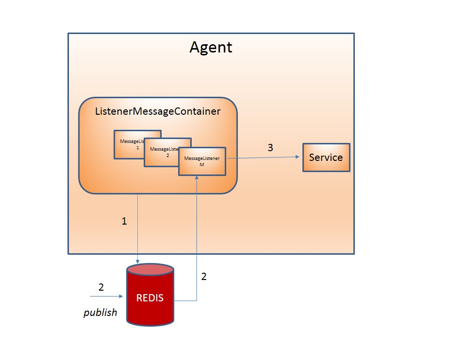
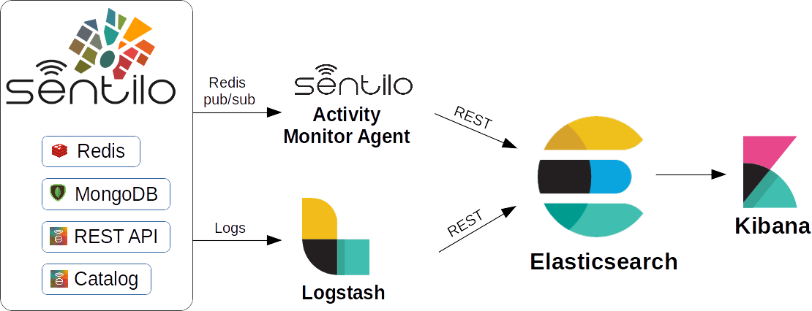
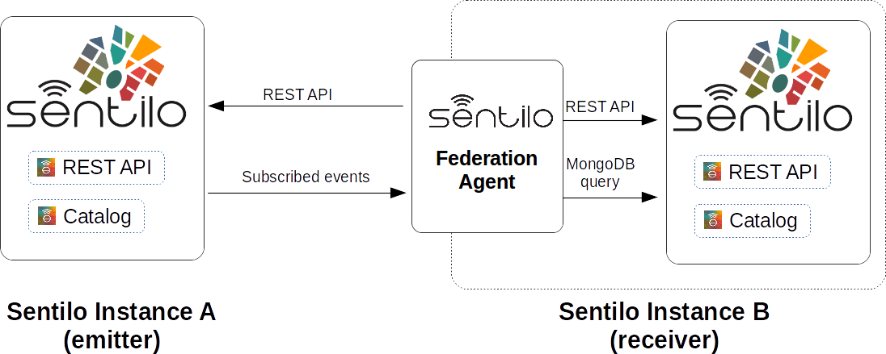
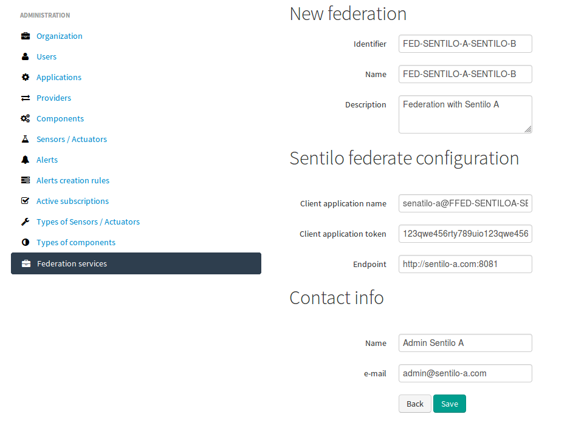
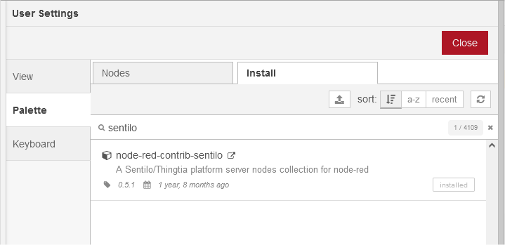
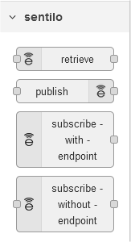
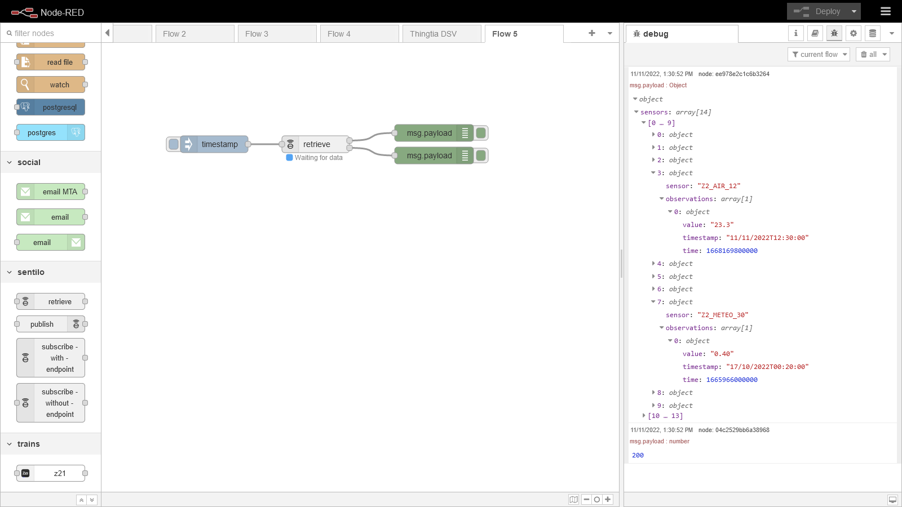
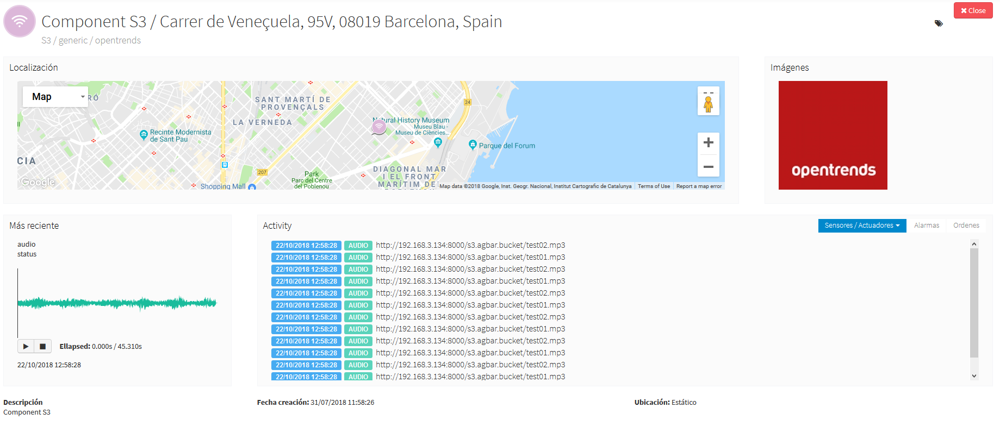

Integrations
============

Agents
------

Agents are internal modules oriented to expand its functionality without
having to alter its core. The installation is based on the principle of
Plug & Play: they are recognized by the system and started automatically
to be up and running.

Every agent is a process that acts as a subscriber for the
publish/subscribe platform. These processes will subscribe directly to
Redis as a independent clients. This subscription will provide the input
data to do the underlying business logic (store in a relational
database, process alarms, generate statistics, …)

The following diagram shows the design that every agent should follow:

1. When agent is started, it subscribes as client to Redis for the event
   that wants to receive notifications.
2. When Redis receives a publication of any of these data, the agent is
   automatically notified with a new message.
3. The message is processed and transferred to the corresponding agent’s
   service responsible to carry out the underlying business logic.

As mentioned above, Sentilo currently provides two agents:

Relational database agent
~~~~~~~~~~~~~~~~~~~~~~~~~

This agent stores all information received from PubSub platform into a
set of relational databases (the number of relational databases is fully
configurable). It could be configured to filter the data to store
according to a business rules through a configuration file.

To do this, when the agent is started it makes a subscription to the
desired information in Redis (observations, orders and/or alarms), that
has previously been defined in a properties file:

::

   //In this example we indicate to persist any data using a DataSource with srDs identifier, 
   //and also to store any data from provider with PARKING identifier, 
   //on a different DataSource whose identifier is parkingDs.

   //Finally, we can indicate more than one DataSource destination to persist the same data.

   data\:PARKING*=parkingDs
   data\:*=srDs
   order\:*=srDs
   alarm\:*=srDs,parkingDs

It is imperative that the DataSources are defined in the context of the
agent with the same identifier:

.. code:: xml

   <bean id="srDs" class="org.apache.commons.dbcp.BasicDataSource" 
      destroy-method="close"> 
      ...
   </bean> 

   <bean id="parkingDs" class="org.apache.commons.dbcp.BasicDataSource" 
      destroy-method="close"> 
    ...
   </bean>

This context is defined in the file:

::

   sentilo-agent-relational/src/main/resources/spring/relational-persistence-context.xml

Alarm agent
~~~~~~~~~~~

This agent processes each internal alert defined in the catalog and
publish a notification (a.k.a. *alarm*) when any of the configured
integrity rules are not met.

Due to the type of available rules, this validation process integrity is
divided into two threads:

-  An internal process that runs every minute, evaluates the status of
   each sensor that have associated (*frozen* type) alerts.
-  Additionally, each time a Redis notification is received, alerts
   associated with the data received are evaluated.

Finally, an internal process regularly synchronize the alert list, to
synchronize the information stored in memory with the catalog
repository.

Activity Monitor agent
~~~~~~~~~~~~~~~~~~~~~~

**Background on Activity Monitor Agent**

Sentilo is a publication-subscription platform. The amount of data held
in the system is proportional to Redis deployment and directly depends
on the amount of physical memory available for the Redis server. In
another words, the data has to be probably deleted after a certain
amount of time to free the Redis memory. For example, in the Barcelona
deployment, the data is deleted after approximately one week.

Additionally to data expiration, Sentilo does not provide many
dashboards and those dashboards are not customizable.

In order to fill the gap of historization and dashboards, we use
`Elasticsearch <https://www.elastic.co/products/elasticsearch>`__ and
`Kibana <https://www.elastic.co/products/kibana>`__. Elasticsearch is a
powerful Java-based fulltext search database with REST API. It is
frequently used together with it’s modules, Kibana for dashboards and
Logstash for collecting of logs. The combination of Elasticsearch,
Logstash and Kibana is often called the ELK stack. ELK provides a
comfortable way to store and exploit historical information, and also a
near-realtime monitoring of the platform. Note that Elasticsearch
behaves excellently in cluster mode.

Sentilo events are uploaded to Elasticsearch through a Sentilo agent
called Activity Monitor Agent. The configuration of this agent is
described further in this chapter.

The following image illustrates a possible setup of Sentilo with ELK
stack. Logstash is optional and can be used e.g. for monitoring of
Sentilo logs (like login errors, invalid messages etc.), as well as
monitoring of system resources.

The setup of the ELK stack is well documented and beyond the scope of
this page.

**Configuration**

Activity Monitor Agent is configured with a set of .properties files in
:literal:`sentilo/sentilo-agent-activity-monitor/src/main/resources/properties`.

**subscription.properties**

+-----------------------+-----------------------+-----------------------------------------+
| Property              | Description           | Comments                                |
+=======================+=======================+=========================================+
| topics-to-index       | Regexp pattern on     | Examples of configuration:              |
|                       | event name that       | ::                                      |
|                       | enables               |                                         |
|                       | including/excluding   |                                         |
|                       | events                |    /alarm/*,/data/*,/order/*            |
|                       |                       |                                         |
|                       |                       | Subscribes to all events                |
|                       |                       | ::                                      |
|                       |                       |                                         |
|                       |                       |    /data/PROVIDER1/*, /data/PROVIDER2/* |
|                       |                       |                                         |
|                       |                       |                                         |
|                       |                       | Subscribe only to data of 2 providers    |
|                       |                       |                                         |
+-----------------------+-----------------------+-----------------------------------------+

**monitor-config.properties**

+-----------------------+-----------------------+-----------------------+
| Property              | Description           | Comments              |
+=======================+=======================+=======================+
| elasticsearch.url     | URL of the ES         |                       |
|                       | instance              |                       |
+-----------------------+-----------------------+-----------------------+
| batch.size            | How many evens are    | Every HTTP request    |
|                       | sent to ES at once.   | consumes certain      |
|                       |                       | amount of resources,  |
|                       |                       | thus is convenient to |
|                       |                       | use a ES bulk API.    |
|                       |                       | The agent won't send  |
|                       |                       | events to ES until    |
|                       |                       | batch.size events     |
|                       |                       | occurred.             |
+-----------------------+-----------------------+-----------------------+
| batch.workers.size    | Number of threads the | Determines how many   |
|                       | agent                 | parallel threads      |
|                       |                       | communicate with ES.  |
+-----------------------+-----------------------+-----------------------+
| batch.max.retries     | Number of retries     | Number of intents for |
|                       | when ES is            | upload to ES          |
|                       | unavailable           | instance.             |
+-----------------------+-----------------------+-----------------------+

The agent will create index(es) called sentilo-YYYY-MM.

Configuration of Elasticsearch, Logstash and Kibana is beyond the scope
of this document and can be easily followed on their respective web
pages.

**Compatible versions**

Sentilo has been successfully used in with these versions of ELK (which
does not mean other versions shouldn’t work as well):

-  ELK 5+

Historian agent
~~~~~~~~~~~~~~~

**Background on Historian Agent**

As you already might have learned, Sentilo does not persist data forever
because of limited system resources.

Commonly used setup of a Sentilo instance is to employ one of the agents
to copy the data into some external database or storage.

Since the data volumes can be fairly big and the data are mostly
structured (except when the observations are text), it is convenient to
use a scalable solution for time series such as
`OpenTSDB <http://opentsdb.net/>`__.

OpenTSDB installs of top of HBase and HDFS. Exposes a HTTP REST API and
can be used from `Grafana <http://grafana.org/>`__ as one of it’s
data sources.

**Configuration**

Historian Agent is configured with a set of .properties files in
:literal:`sentilo/sentilo-agent-historian/src/main/resources/properties`.

**subscription.properties**

+-----------------------+-----------------------+---------------------------------------+
| Property              | Description           | Comments                              |
+=======================+=======================+=======================================+
| topics-to-index       | Regexp pattern on     | Examples of configuration             |
|                       | event name that       | ::                                    |
|                       | enables               |                                       |
|                       | including/excluding   |    /alarm/*,/data/*,/order/*          |
|                       | events                |                                       |
|                       |                       |                                       |
|                       |                       | Subscribes to all events              |
|                       |                       | ::                                    |
|                       |                       |                                       |
|                       |                       | /data/PROVIDER1/*,/data/PROVIDER2/*   |
|                       |                       |                                       |
|                       |                       | Subscribes only to                     |
|                       |                       | data of 2 providers                   |
|                       |                       |                                       |
+-----------------------+-----------------------+---------------------------------------+

**monitor-config.properties**

+-----------------------+-----------------------+-----------------------+
| Property              | Description           | Comments              |
+=======================+=======================+=======================+
| opentsdb.url          | URL of the OpenTSDB   |                       |
|                       | instance              |                       |
+-----------------------+-----------------------+-----------------------+
| batch.size            | How many evens are    | Every HTTP request    |
|                       | sent to OpenTSDB at   | consumes certain      |
|                       | once.                 | amount of resources,  |
|                       |                       | thus is convenient to |
|                       |                       | use a OpenTSDB bulk   |
|                       |                       | API. The agent won't  |
|                       |                       | send events to        |
|                       |                       | OpenTSDB until        |
|                       |                       | batch.size events     |
|                       |                       | occurred.             |
+-----------------------+-----------------------+-----------------------+
| batch.workers.size    | Number of threads the | Determines how many   |
|                       | agent                 | parallel threads      |
|                       |                       | communicate with      |
|                       |                       | OpenTSDB.             |
+-----------------------+-----------------------+-----------------------+
| batch.max.retries     | Number of retries     | Number of intents for |
|                       | when OpenTSDB is      | upload to OpenTSDB    |
|                       | unavailable           | instance.             |
+-----------------------+-----------------------+-----------------------+

Configuration of HDFS, HBase, OpenTSDB and is beyond the scope of this
document and can be easily followed on their respective web pages.

**Compatible versions**

Sentilo has been successfully used in with these versions:

-  Hadoop 2.7.2
-  HBase 1.2.1
-  Opentsdb 2.2.0, 2.3.0
-  Grafana 3 +

Federation agent
~~~~~~~~~~~~~~~~

**Description**

The federation agent is a module that permits to share events between two independent instances of Sentilo.
The sharing is unilateral - one Sentilo instance is emitting events and the other is receiving.
The agent is installed at the side of the receiving instance:

The administrator of the emitting Sentilo instance only needs to create a new application and provide the token the
administrator of the receiving instance.
As with any Sentilo application, the administrator is in control of which provider's data are readable by the remote federation agent.

Providers, components and sensors are created automatically in the catalog of the receiving instance by the federation agent.
The agent uses its application token to query the emitting catalog API to obtain remote objects, and uses the local catalog
application id to replicate the locally.

The federation agent creates subscriptions on data it has permission. It creates a HTTP endpoint and tells the emitting instance
to forward the events to this endpoint URL.

**Configuration**

Federation Agent's configuration is in file
:literal:`sentilo/sentilo-agent-federation/src/main/resources/properties/application.properties`.

+---------------------------------------------+---------------------------------------+----------------------------------------------------------------------------------------------------------+
| Property                                    | Default Value                         | Description                                                                                              |
+=============================================+=======================================+==========================================================================================================+
| server.port                                 | 8082                                  | Agent's HTTP port                                                                                        |
+---------------------------------------------+---------------------------------------+----------------------------------------------------------------------------------------------------------+
| rest.client.local.host                      | http://127.0.0.1:8081                 | Local Sentilo API endpoint                                                                               |
+---------------------------------------------+---------------------------------------+----------------------------------------------------------------------------------------------------------+
| sentilo.master.application.id               | sentilo-catalog                       | Local Sentilo application Id. The agent will use the token of the application to make changes in catalog |
+---------------------------------------------+---------------------------------------+----------------------------------------------------------------------------------------------------------+
| catalog.mongodb.host                        | 127.0.0.1                             | Local MongoDB host                                                                                       |
+---------------------------------------------+---------------------------------------+----------------------------------------------------------------------------------------------------------+
| catalog.mongodb.port                        | 27017                                 | Local MongoDB port                                                                                       |
+---------------------------------------------+---------------------------------------+----------------------------------------------------------------------------------------------------------+
| catalog.mongodb.database                    | sentilo                               | Local MongoDB database name                                                                              |
+---------------------------------------------+---------------------------------------+----------------------------------------------------------------------------------------------------------+
| catalog.mongodb.user                        | sentilo                               | Local MongoDB user                                                                                       |
+---------------------------------------------+---------------------------------------+----------------------------------------------------------------------------------------------------------+
| catalog.mongodb.password                    | sentilo                               | Local MongoDB password                                                                                   |
+---------------------------------------------+---------------------------------------+----------------------------------------------------------------------------------------------------------+
| federation.subscription.endpoint            | http://localhost:8082/data/federated/ | Agent URL that will be used in subscriptions in the remote Sentilo instance.                             |
+---------------------------------------------+---------------------------------------+----------------------------------------------------------------------------------------------------------+
| federation.subscription.secret.key.callback | secret-callback-key-change-it         | HMAC secret used for incoming subscription.                                                              |
+---------------------------------------------+---------------------------------------+----------------------------------------------------------------------------------------------------------+
| federation.subscription.max.retries         | 3                                     | Number of retries used for subscription                                                                   |
+---------------------------------------------+---------------------------------------+----------------------------------------------------------------------------------------------------------+
| federation.subscription.max.delay           | 5                                     | Delay used for subscription                                                                               |
+---------------------------------------------+---------------------------------------+----------------------------------------------------------------------------------------------------------+

Further configuration of the agent is available in the "Federation services" menu.

The menu is available when running Tomcat with the option:

::

   -Dsentilo.federation.enabled=true

The "Client application token" input is the token created in the emitting Sentilo instance:

Kafka agent
~~~~~~~~~~~

**Description**

The Kafka agent publishes Sentilo events to Kafka.

**Configuration**

+--------------------------+----------------+-----------------------------------------------------------------------------------------------------+
| Property                 | Default Value  | Description                                                                                         |
+==========================+================+=====================================================================================================+
| kafka.bootstrap.servers  | localhost:9092 | Comma-separated list of Kafka brokers                                                               |
+--------------------------+----------------+-----------------------------------------------------------------------------------------------------+
| zookeeper.nodes          | localhost:2181 | Comma-separated list of Zookeeper nodes                                                             |
+--------------------------+----------------+-----------------------------------------------------------------------------------------------------+
| batch.workers.size       | 10             | Number of worker threads                                                                            |
+--------------------------+----------------+-----------------------------------------------------------------------------------------------------+
| batch.max.retries        | 1              | How many times will the agent try to resend the message to Kafka until it gives up                  |
+--------------------------+----------------+-----------------------------------------------------------------------------------------------------+
| kafka.request.timeout.ms | 30000          |                                                                                                     |
+--------------------------+----------------+-----------------------------------------------------------------------------------------------------+
| kafka.linger.ms          | 100            | Milliseconds before the contents of buffer are sent or until batch fills up, whichever comes first. |
+--------------------------+----------------+-----------------------------------------------------------------------------------------------------+
| kafka.batch.size         | 20000          | Number of bytes of internal buffer. If the size fills up before , contents are sent to Kafka, .     |
|                          |                |                                                                                                     |
|                          |                | Otherwise contents are sent once kafka.linger.ms passed.                                            |
+--------------------------+----------------+-----------------------------------------------------------------------------------------------------+
| kafka.topicPrefix        | sentilo        | Topics in Kafka will start with following prefix. May be left blank                                 |
+--------------------------+----------------+-----------------------------------------------------------------------------------------------------+
| kafka.topicSeparator     | .              | The compound name of topic in Kafka will be separated with this string.                             |
+--------------------------+----------------+-----------------------------------------------------------------------------------------------------+
| kafka.topicNameMode      | topicPerSensor | Possible values of topicNameMode for the "data" event type:                                         |
|                          |                | * topicPerSensor: sentilo.data.providerName.sensorName                                              |
|                          |                | * topicPerProvider: sentilo.data.providerName                                                       |
|                          |                | * topicPerSensorType: sentilo.data.temperature                                                      |
|                          |                | * topicPerMessageType: sentilo.data                                                                 |
|                          |                | * singleTopic: sentilo                                                                              |
|                          |                |                                                                                                     |
+--------------------------+----------------+-----------------------------------------------------------------------------------------------------+

**Compatible versions**

Sentilo has been successfully used in with these versions:

-  Kafka 0.11.0
-  Kafka 0.10.2

Metrics Monitor Agent
~~~~~~~~~~~~~~~~~~~~~

The agent persists internal Sentilo metrics, such as memory usage or number of threads and persists them in Elasticsearch.

Elasticsearch template definition for this agent is located in
:literal:`/sentilo-agent-metrics-monitor/src/main/resources/elasticsearch`.
The template name is *sentilo-metrics* and the index pattern created by the agent is *sentilo-metrics**.

The configuration :literal:`/sentilo/sentilo-agent-metrics-monitor/src/main/resources/properties/monitor-config.properties`
and it's same as for the `Activity Monitor Agent`_. Example configuration:

..

    # Endpoint for elasticsearch
    elasticsearch.url=http://localhost:9200

    # Properties to configure the index process
    batch.size=1
    batch.workers.size=3
    batch.max.retries=1

The difference with the Activity Monitor agent is the Redis topic in :literal:`subscription.properties`:

..

    batch.max.retries=/metrics/*

Clients
-------

Node-red
~~~~~~~~

`Node-RED <https://nodered.org>`__ is a visual programming platform ideal for non-complex integrations and prototyping.

Sentilo plugin is available in Node-RED's marketplace. Simply search for "sentilo" in Palette configuration:

Following nodes should appear in the nodes palette:

Now, you should be able to use Sentilo from Node-RED. For example:

The package contains documentation on how to use Sentilo nodes.
More info at the `Sentilo library page at Node-RED website  https://flows.nodered.org/node/node-red-contrib-sentilo`__.

NodeJS
~~~~~~

We provide a `Node.js <https://nodejs.org/es/>`__ client library that facilitate access to the Sentilo API. The library is no yet a npm package,
but you can still use easily. Lastest version of this library is tested with Node 10 and 12.

More information is in this repository: https://github.com/sentilo/sentilo-client-nodejs

There is also a `tutorial <./tutorials/raspberrypi_tutorial.html>`__ on how to use this library with Raspberry Pi and GPIO with javascript.

Java Client
~~~~~~~~~~~

Sentilo platform includes a Maven artifact :literal:`sentilo-platform-client-java`.
Its source code is `here <https://github.com/sentilo/sentilo/tree/master/sentilo-platform-client-java>`__.
This library is used internally by Sentilo and its agents.

You can check the tutorial of `how to create creating sample web application /tutorials/java_client_tutorial.html`__.
The example uses Spring MVC and can be deployed on a Tomcat.
The code of this tutorial is available at https://github.com/sentilo/sentilo-client-sample-java .

Regardless of the example, the library can be used in any Java application.
Its dependencies are tiny and is framework-agnostic.

Arduino
~~~~~~~

Arduino client HTTP Request library is available here: https://github.com/sentilo/sentilo-client-arduino

There's also `a tutorial on Arduino with Sentilo </tutorials/arduino_tutorial.html>`__.
The source code for the tutorial is available here: https://github.com/sentilo/sentilo-client-arduino

Cloud
-----

AWS S3
~~~~~~

The `AWS S3 <https://aws.amazon.com/s3/>`__ can be used together with Sentilo, if your solution needs
to upload files such as audio snippets, images or files in general.

Sensor can publish links to multimedia files. If these links are always public, catalog will preview them without any additional configuration.

If these media links are private and managed by S3, catalog needs these properties in the file :literal:`catalog-config.properties`:

+--------------------------+------------------+-----------------------------------------------------------------------------------------------------------------------------------------------------------------------------------------------------------------------------------------------------------------------+
| Property                 | Default Value    | Description                                                                                                                                                                                                                                                           |
+==========================+==================+=======================================================================================================================================================================================================================================================================+
| s3.endpoints             | empty            | Base URL that is managed by Sentilo. All links uploaded to Sentilo that begin with this URL will be treated as private links and the Catalog will try to login with its credentials to provide a preview of the file. For example: https://s3-eu-west-3.amazonaws.com |
+--------------------------+------------------+-----------------------------------------------------------------------------------------------------------------------------------------------------------------------------------------------------------------------------------------------------------------------+
| s3.signing.region        | eu-west-3        | AWS signing region                                                                                                                                                                                                                                                    |
+--------------------------+------------------+-----------------------------------------------------------------------------------------------------------------------------------------------------------------------------------------------------------------------------------------------------------------------+
| s3.url.ttl               | 3600000          | Catalog will create a pre-signed URL for the links using this TTL in seconds                                                                                                                                                                                          |
+--------------------------+------------------+-----------------------------------------------------------------------------------------------------------------------------------------------------------------------------------------------------------------------------------------------------------------------+
| s3.aws.access.key.id     | connecta-catalog | Catalog will authenticate with this credential. Has to be equal as catalog.app.id. Obviously, this credential has to exist in s3 and has to in all ACLs of all buckets used by providers. Otherwise, Catalog would not have right create the pre-signed URL.           |
+--------------------------+------------------+-----------------------------------------------------------------------------------------------------------------------------------------------------------------------------------------------------------------------------------------------------------------------+
| s3.aws.secret.access.key | empty            | Catalog will authenticate with this token.                                                                                                                                                                                                                             |
+--------------------------+------------------+-----------------------------------------------------------------------------------------------------------------------------------------------------------------------------------------------------------------------------------------------------------------------+

.. note::

   Sentilo is is currently using path-style API requests.

.. note::

   Sentilo is probably compatible with variety of S3-like platforms on the market that implement the S3 interface.

In the end, you will be able to visualize private links in S3, for example:

`see more <./services/subscription/subscription.html>`__

