Multi Tenant
============

Introduction
------------

The Multi Tenant feature provides the capacity of
creating and managing virtual Sentilo instances related with different
organizations(e.g. cities). Every organization has its own context,
entities and data, and it can share information with third parties at
its will, even it’s possible to have different look & feel for every
tenant.

Above all the tenants, a new role emerges for administer the platform,
manage the organizations and create the necessary users for administer
each one. Additionally, the platform can provide additional services to
its organizations, like common integrations and offer a single map
showing the public information of all its organization.

The Sentilo multi-tenancy model implements level 3 of SAAS maturity
model, which offers a good levels of efficiency and scalability balanced
with a complexity and a reasonable operational costs:

-  Single instance for all the tenants.
-  Same software deployed version for all the entities.
-  Unique typologies for components and sensors.
-  Common data repositories for all the tenants.
-  Personalization and access control for entities through admin
   console.
-  Personalization of look & feel for tenants.
-  Delegated administration for each entity, allowing them to administer
   its own data, devices, users and to share data a their will.

After configuring it, every organization has its own virtual Sentilo
instance and can be administered autonomously.

The Organization concept
~~~~~~~~~~~~~~~~~~~~~~~~

The Organizations represent the different entities, usually cities, that
owns a virtual Sentilo instance. Every one can manage autonomously its
own applications, providers, components and sensors. All these elements
are property of the organization, and nobody outside the organization
can access to them, unless the organization grants access permissions to
other organizations.

Organizations are administered through the various existing user roles,
and according to them, be managed in different ways:

+-----------------------------------+-----------------------------------+
| Role                              | Access type                       |
+===================================+===================================+
| **Super Admin**                   | The Super Admin user can create   |
|                                   | and administer organizations,     |
|                                   | users and typologies              |
+-----------------------------------+-----------------------------------+
| **Admin**                         | The Admin user can only manage    |
|                                   | its own organization parameters   |
|                                   | and has capacity for creating his |
|                                   | own users, applications,          |
|                                   | providers, components, sensors    |
|                                   | and alerts, which will be         |
|                                   | automatically related to its      |
|                                   | organization                      |
+-----------------------------------+-----------------------------------+
| **User**                          | The User can only access to       |
|                                   | public information data about the |
|                                   | applications, providers,          |
|                                   | components, sensors and alerts    |
|                                   | which belong to its own           |
|                                   | organization                      |
+-----------------------------------+-----------------------------------+

Below you can see an organization list from a multi tenant Sentilo
instance, when connecting as super admin user:

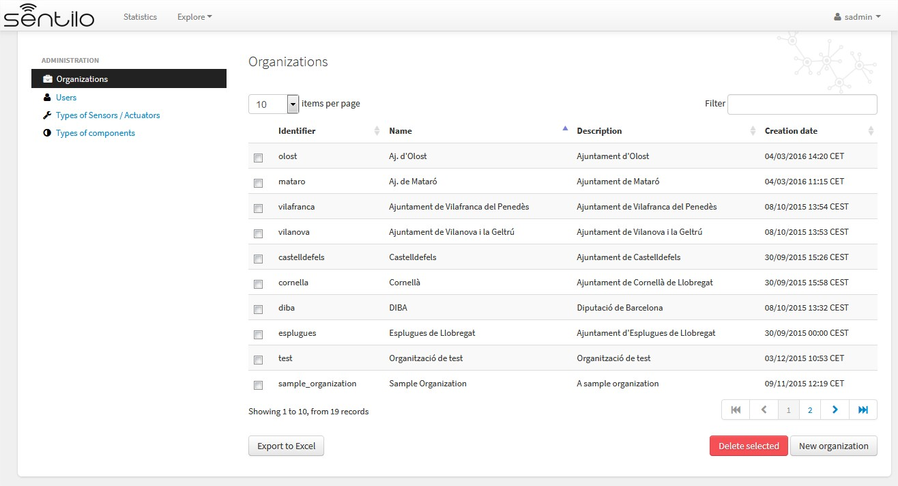

Sentilo contexts
----------------

There are several virtual contexts(URL paths) for a multi tenant Sentilo
instance, one for every organization and one for the public common area.
It’s important to remark that for accessing to each organization
console, you should choose the correct path, otherwise you won’t be able
to access, even using correct credentials.

Organization console
~~~~~~~~~~~~~~~~~~~~

You should access to the administration console through the
corresponding url address, adding the organization id as a last
parameter, as follows.

-  http://sentilo_instance_host[:port]/sentilo-catalog-web/organizationId

In the parameter **organizationId** you should inform the organization
identifier where you want access to. For example, we could access to an
organization named **Sample Organization**, with a
**sample_organization** as organization identifier in a Senilo instance
deployed in a host with name **example.com**:

-  http://example.com/sentilo-catalog-web/sample_organization

Platform console
~~~~~~~~~~~~~~~~

**Super Admin** users should access to the catalog console without
informing any organization identifier in the url. In this case, no data
is filtered by organization, and all the public information is visible
in the public map and statistics:

-  http://your_sentilo_server_ip/sentilo-catalog-web

Super Admin users are responsible of configuring the platform
organizations and its users, and also to define the component and sensor
typologies.

Anonymous access
~~~~~~~~~~~~~~~~

Anonymous users(not logged) can access the universal viewer directly
without informing organization in the url. In this case, no data is
filtered by organization, and all public information is displayed in the
public maps and statistics, using the platform common look & feel.

-  http://sentilo_instance_host[:port]/sentilo-catalog-web

In this case, the user will see all the public information provided for
the instance organizations.

Alternatively, the users can access to a specific organization public
information, specifying a different URL context:

-  http://sentilo_instance_host[:port]/sentilo-catalog-web/organizationId

For example, we could access to an organization named **Sample
Organization**, with a **sample_organization** as organization
identifier in a Sentilo instance deployed in a host with name
**example.com**:

-  http://example.com/sentilo-catalog-web/sample_organization

Then the user will see all the public data offered by the Sample
Organization, displayed using the organization custom look & feel.

For the rest of it, the features and behaviour of the public area is the
same as described in `Catalog and Maps
section <./catalog_and_maps.html>`__.

Platform administration
-----------------------

Super Admin users are responsible of configuring the platform
organizations and its users, and also to define the component and sensor
typologies. They cannot see any organization data, such as components,
sensors, alerts.

Organization administration
~~~~~~~~~~~~~~~~~~~~~~~~~~~

List
^^^^

Only the **Super Admin** user can *list, create and delete
organizations*. After the organization is created, an **Admin** user can
edit its own configuration settings. **User** role don’t have access to
this information.

Details
^^^^^^^

Below, the organization creation form, as a Super Admin:

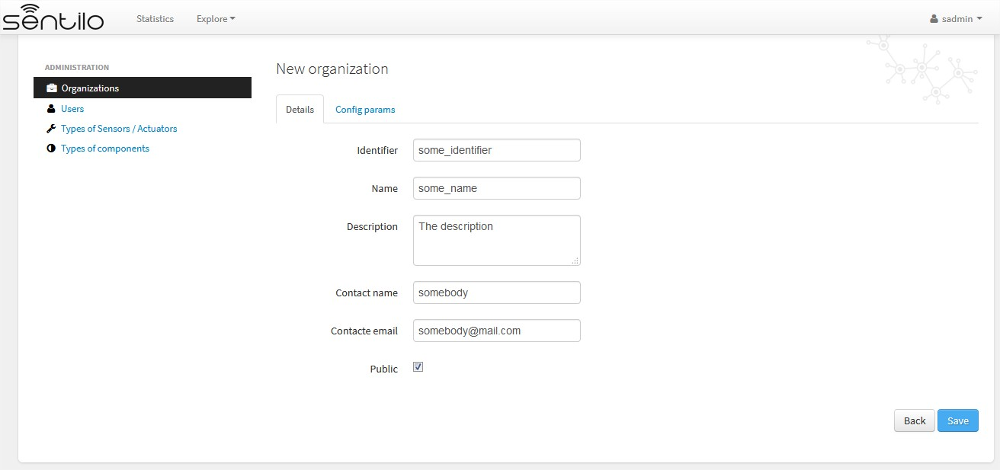

In order to create an organization, we must inform, at least, these
parameters:

-  **identifier**: an unique organization identifier
-  **name**: the organization name
-  **contact name**: the name of the responsible person
-  **contact email**: the email of the responsible person

Some other parameters are optional:

-  **description**: some description about the organization

Config params
^^^^^^^^^^^^^

There are some additional parameters for customizing the public &
private behavior.

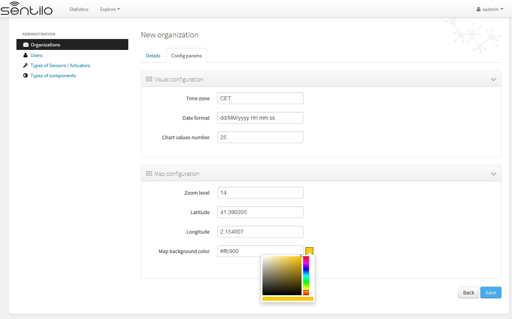

Visual configuration
''''''''''''''''''''

These params will apply to the entire catalog application visual
customization, and how the user will see the data. Note that time zone &
date format are directly relationated.

+-----------------------+-----------------------+-----------------------+
| Property              | Description           | Comments              |
+=======================+=======================+=======================+
| Time zone             | Defines the time zone | You can define hourly |
|                       | of the organization,  | difference or time    |
|                       | and modifies the way  | zone abbreviations:   |
|                       | to display data on    | CET, UTC, +001...     |
|                       | screen, such as dates |                       |
+-----------------------+-----------------------+-----------------------+
| Date format           | Defines the date      | Example: dd/MM/yyyy   |
|                       | format with which the | HH:mm:ss = 30/11/2017 |
|                       | data will be          | 15:34:56              |
|                       | displayed in the      | See all possible      |
|                       | application (lists,   | formats as Java Date  |
|                       | details...)           | Format, at: `Java     |
|                       |                       | Date Format`_         |
+-----------------------+-----------------------+-----------------------+
| Chart values number   | Number of             | It must be a positive |
|                       | observations          | integer number        |
|                       | displayed on chart    | greater or equals to  |
|                       |                       | 10. If blank, it will |
|                       |                       | be a default value of |
|                       |                       | 10.                   |
|                       |                       | This value will be    |
|                       |                       | overwritten by        |
|                       |                       | sensor's              |
|                       |                       | configuration one.    |
+-----------------------+-----------------------+-----------------------+

.. _Java Date Format: https://docs.oracle.com/javase/7/docs/api/java/text/SimpleDateFormat.html

Map configuration
'''''''''''''''''

These params configure the universal map visualization.

+-----------------------+-----------------------+-----------------------+
| Property              | Description           | Comments              |
+=======================+=======================+=======================+
| Zoom level            | Zoom level of the     | Default value is 14.  |
|                       | universal map         | And you can define a  |
|                       |                       | value between 1 and   |
|                       |                       | 20.                   |
|                       |                       | See possible values   |
|                       |                       | in:                   |
|                       |                       | https://developers.go |
|                       |                       | ogle.com/maps/documen |
|                       |                       | tation/static-maps/in |
|                       |                       | tro#Zoomlevels        |
+-----------------------+-----------------------+-----------------------+
| Latitude / Longitude  | Defines the map       |                       |
|                       | center in latitude &  |                       |
|                       | longitude values      |                       |
|                       | format                |                       |
+-----------------------+-----------------------+-----------------------+
| Map background color  | Define the background | Possible values       |
|                       | color of the map      | applies with the      |
|                       |                       | colorpicker, or input |
|                       |                       | a valid css / html    |
|                       |                       | color value           |
+-----------------------+-----------------------+-----------------------+

Users administration
~~~~~~~~~~~~~~~~~~~~

The Super Admin user can create, edit and delete any user from any
Organization whatever role they have. In Addition, Super Admin role is
the unique user role that can create additional Super Admin users.

In a multi tenant instance, except for Super Admin users, when creating
users, it’s mandatory to specify the related organization.

.. _user-admin-list-1:

List
^^^^

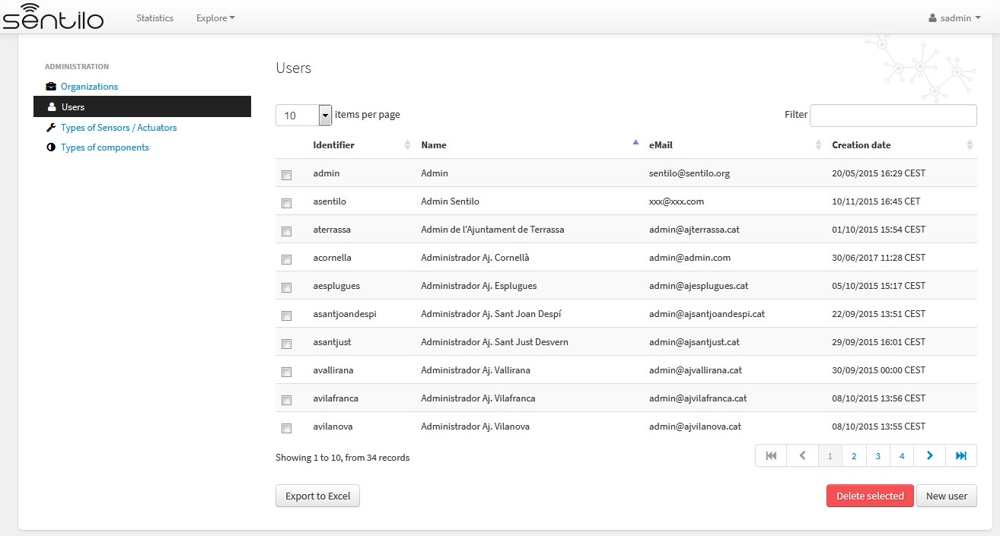

New user
^^^^^^^^

.. _multitenant-new-user-details-1:

Details
'''''''

The next image shows how the new user’s form is:

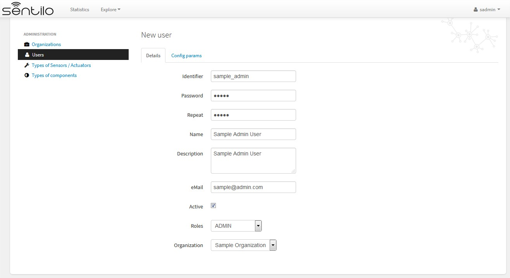

Alternatively, we can inform some configuration params that will modify
the catalog visualization for this user:

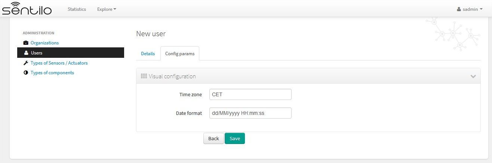

These params will apply to the entire catalog application visual
customization, and how the user will see the data. Note that time zone &
date format are directly relationated.

+-----------------------+-----------------------+-----------------------+
| Property              | Description           | Comments              |
+=======================+=======================+=======================+
| Time zone             | Defines the time zone | You can define hourly |
|                       | of the user, and      | difference or time    |
|                       | modifies the way to   | zone abbreviations:   |
|                       | display data on       | CET, UTC, +001...     |
|                       | screen, such as dates | Example: dd/MM/yyyy   |
|                       |                       | HH:mm:ss = 30/11/2017 |
|                       |                       | 15:34:56\ *           |
|                       |                       | Note that this value  |
|                       |                       | overrides the         |
|                       |                       | organization's one,   |
|                       |                       | if informed*          |
+-----------------------+-----------------------+-----------------------+
| Date format           | Defines the date      | See all possible      |
|                       | format with which the | formats as Java Date  |
|                       | data will be          | Format, at: `Java     |
|                       | displayed in the      | Date Format`_         |
|                       | application (lists,   | *Note that this value |
|                       | details...)           | overrides the         |
|                       |                       | organization's one,   |
|                       |                       | if informed*          |
+-----------------------+-----------------------+-----------------------+

.. _Java Date Format: https://docs.oracle.com/javase/7/docs/api/java/text/SimpleDateFormat.html

Component and Sensor types administration
~~~~~~~~~~~~~~~~~~~~~~~~~~~~~~~~~~~~~~~~~

Only the Super Admin user can administer the components and sensor
types. In this case, the behaviour is the same like for a normal Sentilo
instance.

See more information about it in the [[*Catalog and Maps
section*>>doc:Catalog & Maps]].

Tenant administration
---------------------

Admin role users are directly related with an specific organization.
They are the only ones who are able to administer the organization
private data, such as its providers, applications, components, sensors
and alarms. They can also manage its own users. The admin users will
also be capable of seeing all the defined component and sensor
typologies, but they wont be able to modify them.

Basically, the only difference between the simple Sentilo instance and a
Multi Tenant instance version is that only users from one organization
can see and access to information from its own organization. It’s also
possible to share information with another organizations, as described
later. This data isolation make possible taking advantage of user and
organization hierarchy.

Below, we review the specific behaviour of tenant administration,
remarking is specificities. For more information, you can read the
[[**Catalog and Maps**>>doc:Catalog & Maps]] section.

.. _organization-administration-1:

Organization administration
~~~~~~~~~~~~~~~~~~~~~~~~~~~

Admin users can only manage its own organization information.

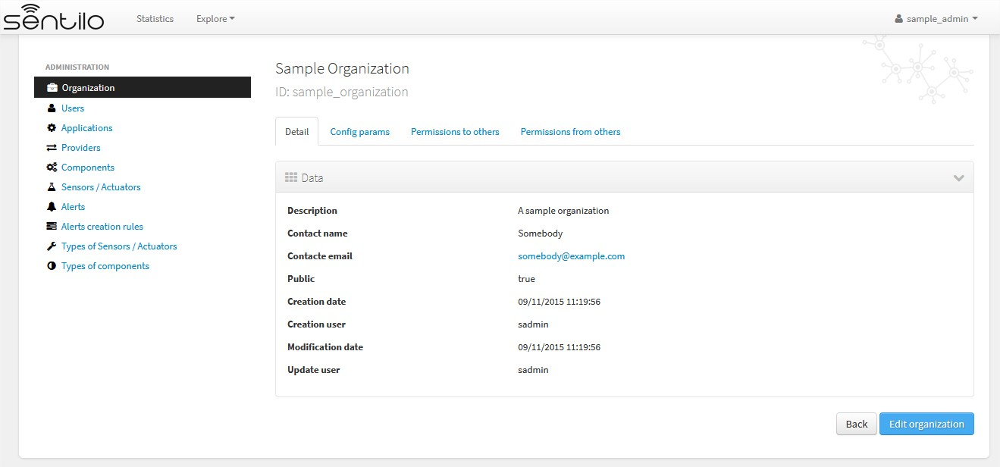

Alternatively, Admin user can manage their config params and third party
from/to permissions for sharing information purposes. You’ll find them
in the two last tabs that located in the top of the detail section.

Permission administration
^^^^^^^^^^^^^^^^^^^^^^^^^

+-----------------------------------+-----------------------------------+
| Permission type                   | Functionality                    |
+===================================+===================================+
| **To third party organizations    | Grant read / write permissions to |
| from us**                         | other organizations over our      |
|                                   | providers (and dependent          |
|                                   | components / sensors / alerts).   |
|                                   | We can add an drop these          |
|                                   | permissions.                      |
+-----------------------------------+-----------------------------------+
| **From third party organizations  | Read / Write permissions from     |
| to us**                           | third party organizations granted |
|                                   | to us. We can only make them      |
|                                   | visible or not in the universal   |
|                                   | map.                              |
+-----------------------------------+-----------------------------------+

Permissions list
''''''''''''''''

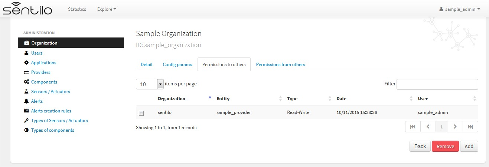

Adding permissions
''''''''''''''''''

Adding to third party read & write permission:

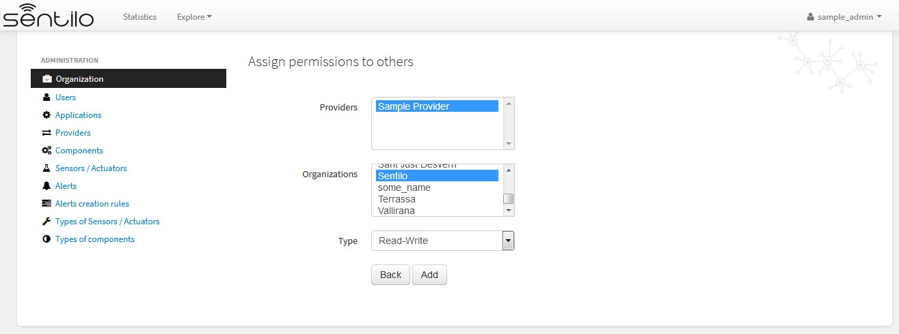

Response upon permission has been created:

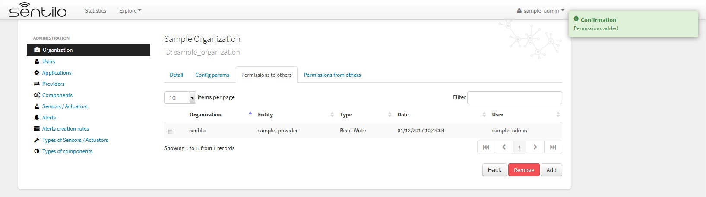

In this case we had granted **read&write** permissions from our
organization and our provider **sample_provider** to third party
organization named **Sentilo**. So, now the Sentilo organization can
access to the sample_provider data and manage ii (publish data).

In the other side, the Sentilo organization can see these permissions in
the second tab, *Permissions from others*:

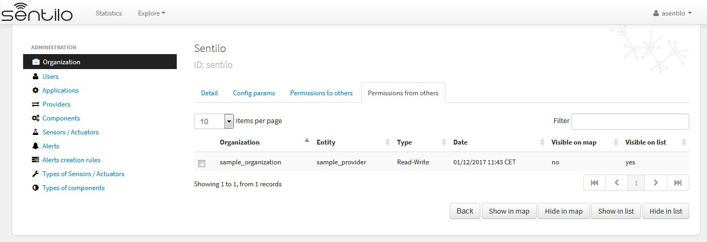

And now, from this tab, we can
change the permission visibility on the map. Simply select the checkbox
from the permission and click on **Show in map** or **Hide in map**.

When sharing providers with other organizations, their related
entities(providers, components, sensors), will appear on the other
tenant console, but only in read mode.

Tenant resources administration: unique identifiers
---------------------------------------------------

Resources related to a tenant, such like *providers* and *applications*,
must have unique identifier into a Sentilo instance. But, in a multi
tenant instance, it is possible to repeat it identifier, based on its
tenant. So tenant resources are completely independent between their
tenants.

Multi tenant instances offers to the user a little visual difference.
You will inform the resource identified with its own tenant identifier
as prefix.

It is transparent for users, but in administration console you’ll see a
flag that informs you that you’re in a multi tenant instance:
**sentilo@the_identifier**, is related to an identifier from Sentilo
tenant organization

Applications
~~~~~~~~~~~~

For application creation form you’ll see this in the Identifier field:

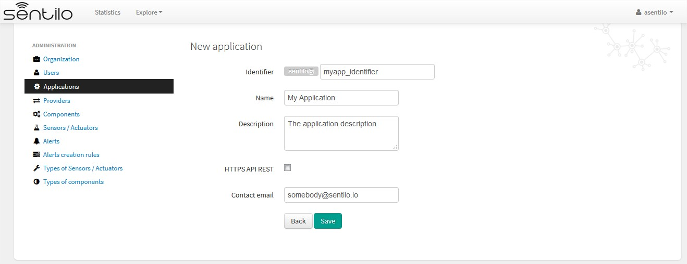

In this case, we’re creating a application
named **My Application** with identifier **myapp_identifier**.

Providers
~~~~~~~~~

For the providers, we would be facing the same case as for the
Applications. Therefore, you can choose the desired identifier,
regardless of the tenant you are managing.

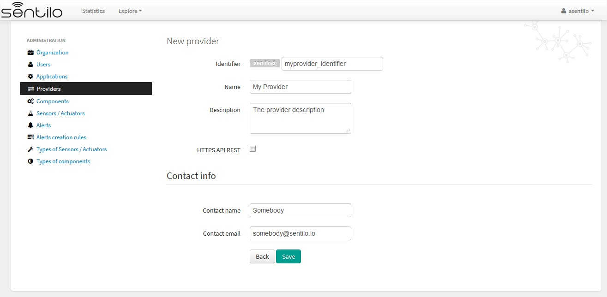

In this case, we’re creating a provider named **My Provider**, with
identifier **myprovider_identifier**.
