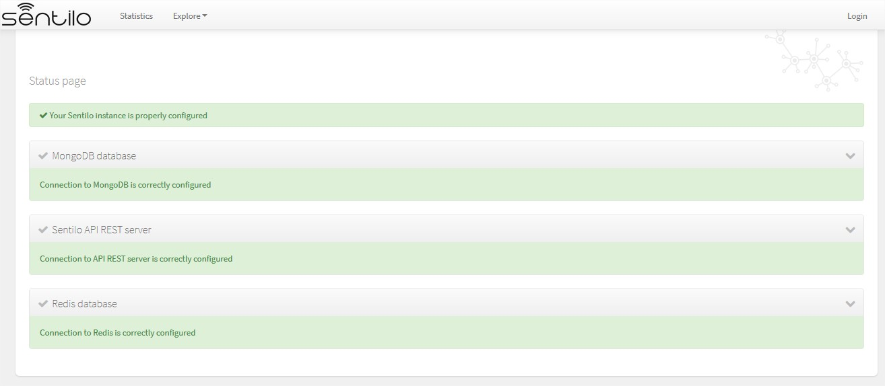
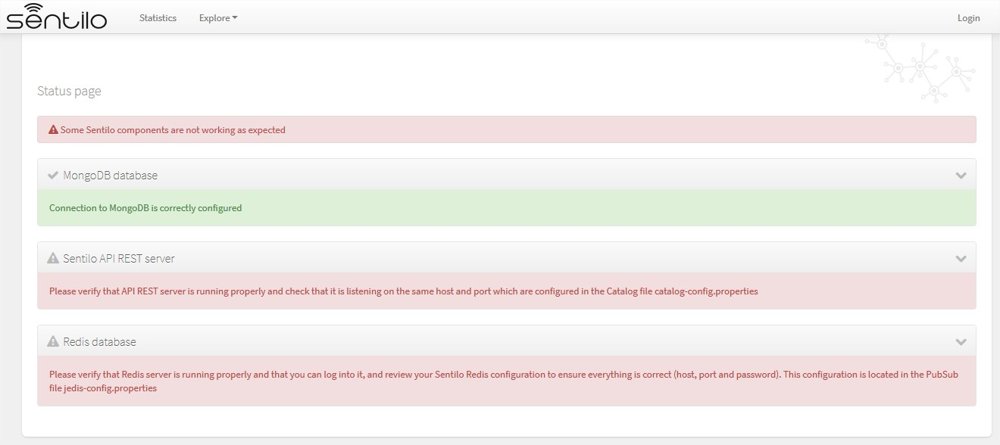
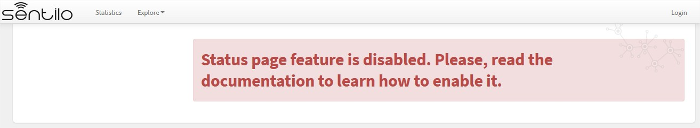

Platform Testing
================

To check everything is properly configured and running, you can run the
following set of tests.

Infrastructure servers test
---------------------------

Status page
~~~~~~~~~~~

To validate that all services are up and running (Redis, MongoDB and
PubSub), you can access to the following catalog page\ **:**

::

   http://ip:port/sentilo-catalog-web/status/

|status_170_001.jpg|

In this screen you can check the status independently for each Sentilo
main service. In each case it will be indicated, through a green status
message, the correct operation of the same. In the event either it is
not possible to connect to the service or there is an error, an error
message will be displayed .

Next screenshot shows to you an error connecting to the API:

|status_170_002.jpg|

Deactivating the status page
^^^^^^^^^^^^^^^^^^^^^^^^^^^^

By default, the status page is enabled in your Sentilo instance.

To disable it, you must provide a JVM Tomcat parameter:

::

   -Dsentilo.state_page.enabled=false

Then, the status page will be inaccessible:

|status_170_003.jpg|

Postman tests
-------------

To test the API REST services individually, you can also test end-end
functionality with `Postman <https://www.getpostman.com>`__, or if you
prefer CLI, via
`Newsman <https://www.getpostman.com/docs/postman/collection_runs/command_line_integration_with_newman>`__:

::

   newman run postman-script.json -e postman-script-env.json --delay-request 5000 --reporters cli,json --reporter-json-export outputfile.json

where files *postman-script.json* and *postman-script-env.json* are
located in subdirectory
`scripts/test <https://github.com/sentilo/sentilo/tree/master/scripts/test>`__
from your local copy of Sentilo.

This script provides tests all Sentilo REST API resources and can serve
you also as example of the API usage.

.. note::

   Before executing tests with newman, you should review the values of the variables
   api_url, api_port, provider and provider_token in the environment file postman-script-env.json
   so that they match your Sentilo instance

Before executing the postman script / or  you should replace default values (extracted from the init_test_data.js file)
with the ones that you want to use to execute it (api_url, api_port, provider and provider_token)
