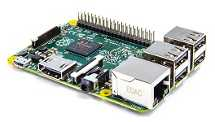
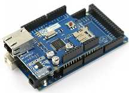

Tutorials
=========

Contents:

.. toctree::
   :maxdepth: 1
   
   tutorials/java_client_tutorial
   tutorials/raspberrypi_tutorial
   tutorials/arduino_tutorial

On this page you will find several tutorials about how to connect to
Sentilo using various existing platforms and languages.

------------------------------------

|spring-framework.png|

Java library that allows
access to Sentilo Platform
through its REST API Client

------------------------------------

|raspberrypi.jpeg|

Independent platform library
created with NodeJS that allows
embedded architectures, such as
Raspberry Pi, to communicate with
Sentilo Platform through its REST
API Client

....................................

|arduino-mega-2560-r3.jpg|

A simple Arduino library that
allows connect with the Official
Ethernet Shield to the Sentilo
Platform

------------------------------------

.. |java_logo.jpg| image:: _static/images/tutorials/java_logo.jpg
   :width: 202px
   :height: 113px
   :target: tutorials/java_client_tutorial.html

