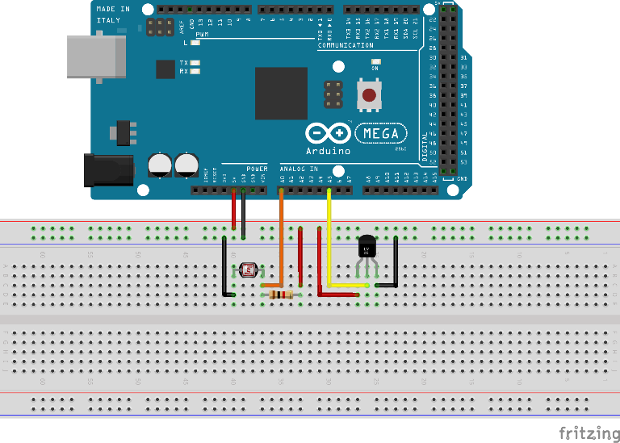

Arduino Tutorial
================

.. figure:: /_static/images/tutorials/arduino-mega-2560-r3.jpg
   :alt: Arduino

The **SentiloClient Library** for Arduino offers a basic C++ library
implementation that allows to the developer a quick integration sketch
with the Sentilo Platform through its API Rest Client.

For these examples we’ll create a new sensor in the Sentilo Platform,
only if it doesn't exists, and then we’re going to publish some
observations obtained from the local sensors.

Hardware
--------

We’ll need some hardware materials:

+-----------------------------------+-----------------------------------+
| Material                          | Description                       |
+-----------------------------------+-----------------------------------+
| **>Arduino board**                | We recommend that you use a       |
|                                   | **Mega 2560** board, which brings |
|                                   | to you a bit more program memory  |
|                                   | than Uno.                         |
+-----------------------------------+-----------------------------------+
| **>Official Ethernet Shield for   | The library is based on the       |
| Arduino**                         | communication layer that provides |
|                                   | the Official Ethernet Shield.     |
|                                   | Basically, it is a http rest      |
|                                   | client module.                    |
+-----------------------------------+-----------------------------------+
| **Some sensors**                  | For these examples we'll use two  |
|                                   | types of sensors: a *LM35*        |
|                                   | temperature sensor, and a basic   |
|                                   | *LDR* brightness sensor           |
|                                   | (photocell)                       |
+-----------------------------------+-----------------------------------+
| **Resistors**                     | Two 1KOhm resistors 1/4W          |
+-----------------------------------+-----------------------------------+
| **Breadboard**                    | A breadboard that allow to you    |
|                                   | the quick connection of the       |
|                                   | electronic components             |
+-----------------------------------+-----------------------------------+
| **Wires**                         | Connection wires, like *'dupont'* |
|                                   | male-to-male ones, that brings to |
|                                   | you easily connection between the |
|                                   | Arduino board and the breadboard  |
|                                   | and the sensors                   |
+-----------------------------------+-----------------------------------+
| **Ethernet cable**                | A cable for connecting the        |
|                                   | Ethernet Shield to the Internet   |
|                                   | through your router o modem       |
+-----------------------------------+-----------------------------------+
| **B type USB cable**              | A cable for connecting your       |
|                                   | Arduino board to the PC           |
+-----------------------------------+-----------------------------------+

Software
--------

We’ll use the **Official Arduino IDE**, that you can download from
`here <http://www.arduino.cc/en/Main/Software>`__. Of course, you’ll
need a PC, with Windows or Linux, or a Mac computer.

Setup the Arduino
-----------------

The Arduino IDE
~~~~~~~~~~~~~~~

We assume that you have installed the **Arduino IDE** and you know how
to use it :). If not, then you can have a look on this
`link <http://www.arduino.cc/en/Guide/HomePage>`__.

Download and install the library
~~~~~~~~~~~~~~~~~~~~~~~~~~~~~~~~

Download our **SentiloClient** library or clone it from Git via this
link: https://github.com/sentilo/sentilo-client-arduino, and then
install it as a custom library into your Arduino IDE. If you don’t know
how to install custom libraries, you can have a look on this
`link <http://www.arduino.cc/en/guide/libraries>`__, see the **Importing
a .zip Library** section.

The example
-----------

First example: publishing a basic observation
~~~~~~~~~~~~~~~~~~~~~~~~~~~~~~~~~~~~~~~~~~~~~

Once you have installed the library into the Arduino IDE, you can go to
the menu option **File > Examples > SentiloClient >
SentiloClient-Example-01** and open the sample code. In this example
Arduino is going to connect to the network and publish a basic
observation with these contents: **“This is a sample observation”**.

Sentilo configuration
^^^^^^^^^^^^^^^^^^^^^

You must have configured this information in the Sentilo catalog:

-  A provider (in our case, named **samples-provider**) and its token
-  A component (in our case, named **sample-component**)
-  A sensor (in our case, named **sample-sensor-arduino-01** for the
   first example, and another one named **sample-sensor-arduino-02** for
   the second one), with this minimum configuration settings:

	::

	   sensor = sample-sensor-arduino-01
	   type = status
	   dataType = TEXT
	   component = sample-component
	   componentType = generic

Then, you must replace the client connection data code (next section)
with yours settings:

-  Change the value **“YOUR_API_KEY”** with the api key of your provider
   (variable *apiKey*)
-  Change the value **“YOUR_IP_ADDRESS”** with the ip address of your
   Sentilo instance (variable *ip*)
-  Change the value **“YOUR_PORT”** with the port of your Sentilo server
   instance port (variable *port*)

The code
^^^^^^^^

You’ll should see this code in the editor:

.. code:: c

   #include <Ethernet.h>
   #include <SPI.h>

   #include "SentiloClient.h"

   /*******************************************/
   /***** SENTILO *****************************/
   /*******************************************/
   char* apiKey = "YOUR_API_KEY";
   char* ip = "YOUR_IP_ADDRESS";
   int port = YOUR_PORT;
   char* componentId = "sample-component";
   char* providerId = "samples-provider";
   char* sensorId = "sample-sensor-arduino-01";

   // The Sentilo Client object
   SentiloClient sentiloClient = SentiloClient(ip, port);

   /*******************************************/
   /***** NETWORK *****************************/
   /*******************************************/
   const int networkConnectionTimeout = 30;

   /*******************************************/
   /***** GLOBAL VARS *************************/
   /*******************************************/
   const int generalCalibrationTimeout = 1000; // Wait after system setup is complete
   String response = ""; // Rest call response (normally as JSON message)
   int statusCode = -1; // Rest call return code (the HTTP code)

   void setup() {
           // Begin serial for debug purposes
           Serial.begin(9600);

           // Setup the Sentilo Client and the network connection
           setupSentiloClient();

           // Wait time for a general calibration
           delay(generalCalibrationTimeout);
   }

   void loop() {
           // Create the Observation object
           SentiloClient::Observation observation;
           observation.value = "This is a sample observation";

           Serial.println("[loop] Publishing a sample observation...");

           // Publish the observation to Sentilo Platform
           statusCode = sentiloClient.publishObservation(providerId, sensorId, observation, apiKey, response);

           // Read response status and show an error if it is necessary
           if (statusCode !## 200) {
                   Serial.print("[loop] [ERROR] Status code from server after publish the observations: ");
                   Serial.println(statusCode);
                   Serial.print("[loop] [ERROR] Response body from server after publish the observations: ");
                   Serial.println(response);
           }

           Serial.println("[loop] Sample observation published!");
           Serial.println("[loop] Program ended");

           // The example has ended, so we are going to execute an infinite loop
           while (true) {}
   }

   /** Setup the Sentilo Client object, this process also configures the network connection **/
   void setupSentiloClient() {
           Serial.print("[setup] Connecting to network via DHCP ");
           sentiloClient.dhcp();
           for (int i = 0; i < networkConnectionTimeout; i++) {
                   Serial.print(".");
                   delay(100);
           }
           Serial.println(" done!");
           Serial.println("[setup] Connection is now established!");
   }

What can we see in this example?

-  We are setting up the Serial channel for debug output
-  Setup the **SentiloClient** object (**sentiloClient**), which
   configures the client and connects to the network
-  Once we’re connected to the server, we publish a basic observation,
   with these contents: *“This is a sample observation”*

   -  If the publish works properly, the system don’t return any special
      data
   -  Otherwise, it will show to you the system return code and
      message, if it is possible

-  The test ends after publish only one observation

Second example: publishing sensors data as observations
~~~~~~~~~~~~~~~~~~~~~~~~~~~~~~~~~~~~~~~~~~~~~~~~~~~~~~~

In this case we’ll retrieve data from sensors (LDR and LM35), and then
we’ll publish them as a observation, with a message in JSON format, like
that:

.. code:: json

   {"ldr":"{ldrValue}","lm35":"{lm35Value}"}

Where the **ldrValue** contains the LDR photocell value, and the
**lm35Value** contains the LM35 temperature value. Open the sample code
in **File > Examples > SentiloClient > SentiloClient-Example-02**.

Connect the sensors and and other connections
^^^^^^^^^^^^^^^^^^^^^^^^^^^^^^^^^^^^^^^^^^^^^

Now, it is the time to connect the sensors and others elements.

See below:

|arduino_sensors_board.png|

In the upper image, you can see how the components has been located:

-  Connect the *positive* pin from **Arduino (+5V)** to the upper
   channel of the breadboard *(red channel)*
-  Connect the *negative* pin from **Arduino (GND)** to the second
   channel of the breadboard *(blue channel)*
-  **LDR** photocell sensor connection:

   -  Connect the LDR photocell between **GND signal and A0** (Analog IO
      0 from Arduino) with a dupont wire, in this case, the orange color
      wire
   -  Connect the LDR pin that holds the orange wire with a 1KOhm
      resistor, and the other resistor pin to **Arduino +5V** (red wire)

-  **LM35** temperature sensor:

   -  Connect the LM35 **positive pin** (left pin, front side) to
      **Arduino +5V**
   -  Connect the LM35 **center pin** (signal) to the A5 (Analog IO 5
      from Arduino) with a dupont wire, in this case, the orange color
      wire
   -  Connect the LM35 **negative pin** (right pin, front side) to
      **Arduino GND**

.. _the-code-1:

The code
^^^^^^^^

You should see this code in the editor:

.. code:: c

   #include <Ethernet.h>
   #include <SPI.h>

   #include "SentiloClient.h"

   /*******************************************/
   /***** SENSORS *****************************/
   /*******************************************/
   int LDR = 0; // LDR input is A0
   int LM35 = 5; // LM35 input is A5
   const int ldrSetupTimeout = 10; // Time that LDR needs to be configures (dummy time)
   const int lm35SetupTimeout = 10; // Time that LM35 needs to be configures (dummy time)

   /*******************************************/
   /***** SENTILO *****************************/
   /*******************************************/
   char* apiKey = "YOUR_API_KEY";
   char* ip = "YOUR_IP_ADDRESS";
   int port = YOUR_PORT;
   char* componentId = "sample-component";
   char* providerId = "samples-provider";
   char* sensorId = "sample-sensor-arduino-02";

   // The Sentilo Client object
   SentiloClient sentiloClient = SentiloClient(ip, port);

   /*******************************************/
   /***** NETWORK *****************************/
   /*******************************************/
   const int networkConnectionTimeout = 30;

   /*******************************************/
   /***** GLOBAL VARS *************************/
   /*******************************************/
   const int generalCalibrationTimeout = 1000; // Wait after system setup is complete
   const int loopTimeout = 60000; // Loop timeout, time between observations (in ms)
   String response = ""; // Rest call response (normally as JSON message)
   int statusCode = -1; // Rest call return code (the HTTP code)

   boolean existsSensor = false;

   void setup() {
           // Begin serial for debug purposes
           Serial.begin(9600);

           // Setup the LDR sensor
           setupLDR();

           // Setup the LM35 sensor
           setupLM35();

           // Setup the Sentilo Client and network connection
           setupSentiloClient();

           // Wait time for a general calibration
           delay(generalCalibrationTimeout);
   }

   void loop() {
           // Get the LDR value
           int ldrValue = getLdrValue();

           // Get the LM35 value
           float lm35Value = getLM35Value();

           // Create the observation input message like this: {"ldr":"234","lm35":"24.5"}
           String obsInputMsg =
                   "{\\\"ldr\\\":\\\"" + String(ldrValue) +
                   "\\\",\\\"lm35\\\":\\\"" + String(lm35Value) +
                   "\\\"}";
           int bufLength = obsInputMsg.length() + 1;
           char obsMsgBuffer[bufLength];
           obsInputMsg.toCharArray(obsMsgBuffer, bufLength);

           // Create the Observation object
           SentiloClient::Observation observation;
           observation.value = obsMsgBuffer;

           // Debug on Serial the observations value. Note that we must scape special characters
           Serial.print("[loop] Publishing actual sensors values as observations: ");
           Serial.println(obsMsgBuffer);

           // Publish the observation to Sentilo Platform
           statusCode = sentiloClient.publishObservation(providerId, sensorId, observation, apiKey, response);

           // Read response status and show an error if it is necessary
           if (statusCode !## 200) {
                   Serial.print("[loop] [ERROR] Status code from server after publish the observations: ");
                   Serial.println(statusCode);
                   Serial.print("[loop] [ERROR] Response body from server after publish the observations: ");
                   Serial.println(response);
           } else {
                   Serial.println("[loop] Sensors observations published!");
           }

           delay(loopTimeout);
   }

   /** Emulate a possible LDR initialization process, if it is necessary **/
   void setupLDR() {
           Serial.print("[setup] Setting up the LDR brightness sensor ");
           for (int i = 0; i < ldrSetupTimeout; i++) {
                   Serial.print(".");
                   delay(100);
           }
           Serial.println(" done!");
           delay(50);
   }

   /**  Get the brightness value from th LDR **/
   int getLdrValue() {
           return analogRead(LDR);
   }

   /** Emulate a possible LM35 initialization process, if it is necessary **/
   void setupLM35() {
           Serial.print("[setup] Setting up the LM35 temperature sensor ");
           for (int i = 0; i < lm35SetupTimeout; i++) {
                   Serial.print(".");
                   delay(100);
           }
           Serial.println(" done!");
           delay(50);
   }

   /** Get the LM 35 temperature value in Celsius degrees **/
   float getLM35Value() {
           int val = analogRead(LM35);
           float mv = (val / 1024.0) * 5000;
           float cel = mv / 10;
           //float farh = (cel * 9) / 5 + 32;
           return cel;
   }

   /** Setup the Sentilo Client object. This process also configures the network connection **/
   void setupSentiloClient() {
           // Connect via DHCP
           Serial.print("[setup] Connecting to network via DHCP ");
           sentiloClient.dhcp();
           for (int i = 0; i < networkConnectionTimeout; i++) {
                   Serial.print(".");
                   delay(100);
           }
           Serial.println(" done!");
           Serial.println("[setup] Connection is now established!");
   }

What can we see in this example? There’re some additions compared with
the first example.

-  Setup Arduino and the SentiloClient is the same of the first sample
-  We’re making a sensors setup, but in this case it isn’t necessary, so
   it only informs us in debug mode what is happening in every moment…
-  Into the loop

   -  We’re retrieving the LDR and LM35 values, and putting them into
      variables
   -  Once we’ve retrieved the sensors data, we’re mounting the new
      observation message, with value:
      ``{"ldr":"{ldrValue}","lm35":"{lm35Value}"}``

   -  The SentiloClient library gets the value and transforms it on a
      complete **observation message** using the **publishObservation**
      method (see below)

-  The sketch loops sleeps until **loopTimeout** millis has been
   reached, and then turns up and repeats the same process of data
   publication (in this example the sleep time is 60000ms, 1 minute per
   loop / publish)

This is the observation sent by to the Sentilo platform:

.. code:: json

   {"observations":[{
           "value":"{\"ldr\":\"{ldrValue}\",\"lm35\":\"{lm35Value}\"}"
      }]
   }

If you want, you can include the **timestamp** variable in UTC format
inside the observation object:

.. code:: c

   Observation observation;
   observation.value = {"ldr":"382","lm35":"23.4"};
   observation.timestamp = "05/05/2015T12:34:45";

And the message will be generated as:

.. code:: json

   {"observations": [{
           "value":"{\"ldr\":\"382\",\"lm35\":\"23.4\"}",
           "timestamp":"05/05/2015T12:34:45"
      }]
   }

As you can see, the library object Observation (struct type) offers you
an abstraction. In the next sample we will see them in working together
with the Sensor object.

Third example: initialize sensor, create it in the catalog and publish observations continuously
~~~~~~~~~~~~~~~~~~~~~~~~~~~~~~~~~~~~~~~~~~~~~~~~~~~~~~~~~~~~~~~~~~~~~~~~~~~~~~~~~~~~~~~~~~~~~~~~

In this third example we’ll see that how the SentiloClient library can
create a sensor “on-the-fly” and publish observations continuously. Next,
we’ll use the second example, plus a little bit of additional code that
help us to check if the sensor exists in the catalog, and if not create
it before publish observations. Open the sample code in **File >
Examples > SentiloClient > SentiloClient-Example-03**.

.. _the-code-2:

The code
^^^^^^^^

You should see this code in the editor:

.. code:: c

   #include <Ethernet.h>
   #include <SPI.h>

   #include "SentiloClient.h"

   /*******************************************/
   /***** SENSORS *****************************/
   /*******************************************/
   int LDR = 0; // LDR input is A0
   int LM35 = 5; // LM35 input is A5
   const int ldrSetupTimeout = 10; // Time that LDR needs to be configures (dummy time)
   const int lm35SetupTimeout = 10; // Time that LM35 needs to be configures (dummy time)

   /*******************************************/
   /***** SENTILO *****************************/
   /*******************************************/
   char* apiKey = "YOUR_API_KEY";
   char* ip = "YOUR_IP_ADDRESS";
   int port = YOUR_PORT;
   char* componentId = "sample-component";
   char* providerId = "samples-provider";
   char* sensorId = "sample-sensor-arduino-03";

   // The Sentilo Client object
   SentiloClient sentiloClient = SentiloClient(ip, port);

   /*******************************************/
   /***** NETWORK *****************************/
   /*******************************************/
   const int networkConnectionTimeout = 30;

   /*******************************************/
   /***** GLOBAL VARS *************************/
   /*******************************************/
   const int generalCalibrationTimeout = 1000; // Wait after system setup is complete
   const int loopTimeout = 60000; // Loop timeout, time between observations publications (in ms)
   String response = ""; // Rest call response (normally as JSON message)
   int statusCode = -1; // Rest call return code (the HTTP code)

   boolean existsSensor = false;

   void setup() {
           // Begin serial for debug purposes
           Serial.begin(9600);

           // Setup the LDR sensor
           setupLDR();

           // Setup the LM35 sensor
           setupLM35();

           // Setup the Sentilo Client
           // and network connection
           setupSentiloClient();

           // Setup the Sentilo sensor
           // and create it if doesn't exists
           setupSentiloSensor();

           // Waiting for the next release of the observation
           delay(generalCalibrationTimeout);
   }

   void loop() {
           if (existsSensor) {
                   // If the sensor exists,
                   // we can start publishing observations

                   // Get the LDR value
                   int ldrValue = getLdrValue();

                   // Get the LM35 value
                   float lm35Value = getLM35Value();

                   // Create the observation input message
                   // like this: {"ldr":"234","lm35":"24.5"}
                   String obsInputMsg =
                           "{\\\"ldr\\\":\\\"" + String(ldrValue) +
                           "\\\",\\\"lm35\\\":\\\"" + String(lm35Value) +
                           "\\\"}";
                   int bufLength = obsInputMsg.length() + 1;
                   char obsMsgBuffer[bufLength];
                   obsInputMsg.toCharArray(obsMsgBuffer, bufLength);

                   // Create the Observation object
                   SentiloClient::Observation observation;
                   observation.value = obsMsgBuffer;

                   // Debug on Serial the observations value
                   // Note that the message includes slashes (\) because we must scape special characters as "
                   Serial.print("[loop] Publishing actual sensors values as observations: ");
                   Serial.println(obsMsgBuffer);

                   // Publish the observation to Sentilo Platform
                   statusCode = sentiloClient.publishObservation(providerId, sensorId, observation, apiKey, response);

                   // Read response status and show an error if it is necessary
                   if (statusCode !## 200) {
                           Serial.print("[loop] [ERROR] Status code from server after publish the observations: ");
                           Serial.println(statusCode);
                           Serial.print("[loop] [ERROR] Response body from server after publish the observations: ");
                           Serial.println(response);
                   } else {
                           Serial.println("[loop] Sensors observations published!");
            }

           // Waiting for the next loop
           delay(loopTimeout);
           } else {
                   // If the sensor does not exist and it could
                   // not be created in the catalog, we must stop running
                   Serial.println("[loop] [ERROR] Oops! The sensor doesn't exists, so I can't publish data to it...");
                   Serial.println("[loop] [ERROR] I'm sorry with you, but now I'm going to halt...");
                   Serial.println("[loop] [ERROR] Bye!");
                   while (true) { }
           }
   }

   // Emulate a possible LDR initialization process, if it is necessary
   void setupLDR() {
           Serial.print("[setup] Setting up the LDR brightness sensor ");
           for (int i = 0; i < ldrSetupTimeout; i++) {
                   Serial.print(".");
                   delay(100);
           }
           Serial.println(" done!");
           delay(50);
   }

   // Get the brightness value from th LDR
   int getLdrValue() {
           return analogRead(LDR);
   }

   // Emulate a possible LM35 initialization process, if it is necessary
   void setupLM35() {
           Serial.print("[setup] Setting up the LM35 temperature sensor ");
           for (int i = 0; i < lm35SetupTimeout; i++) {
                   Serial.print(".");
                   delay(100);
           }
    Serial.println(" done!");
           delay(50);
   }

   // Get the LM 35 temperature value in Celsius degrees
   float getLM35Value() {
           int val = analogRead(LM35);
           float mv = (val / 1024.0) * 5000;
           float cel = mv / 10;
           //float farh = (cel * 9) / 5 + 32;
           return cel;
   }

   // Setup the Sentilo Client object
   // This process also configures the network connection
   void setupSentiloClient() {
           // Connect via DHCP
           Serial.print("[setup] Connecting to network via DHCP ");
           sentiloClient.dhcp();
           for (int i = 0; i < networkConnectionTimeout; i++) {
                   Serial.print(".");
                   delay(100);
           }
           Serial.println(" done!");
           Serial.println("[setup] Connection is now established!");
   }

   // Setup the Sentilo Sensor (this Arduino)
   // If the sensor doesn't exists in the catalog, create it
   void setupSentiloSensor() {
           Serial.println("[setup] Retrieving catalog info from Sentilo and search for the sensor...");

           // Get catalog data for the provider with the supplied api key
           statusCode = sentiloClient.getCatalog(apiKey, response);

           // If the server status response is not ok, show the error
           if (statusCode !## 200) {
                   Serial.print("[setup] [ERROR] Status code from server getting catalog: ");
                   Serial.println(statusCode);
                   Serial.print("[setup] [ERROR] Response body from server getting catalog: ");
                   Serial.println(response);
           } else {
                   // If we get a correct response, we must search the sensor
                   if (find_text(sensorId, response) >## 0) {
                           // The sensor is in the catalog
                           Serial.println("[setup] The sensor is in the catalog");
                           existsSensor = true;
                   } else {
                           // The sensor isn't in the catalog, so we must create it
                           Serial.println("[setup] The sensor isn't in the catalog, so let register it now...");

                           // Create the basic Sentilo Sensor Object
                           SentiloClient::Sensor sensor;
                           sensor.sensor = sensorId;
                           sensor.type = "status";
                           sensor.dataType = "TEXT";
                           sensor.component = componentId;
                           sensor.componentType = "generic";
                           sensor.location = "sensorLat sensorLng";

                           // Call the SentiloClient Register Sensor function
                           statusCode = sentiloClient.registerSensor(sensor, providerId, apiKey, response);

                           // Read the server status response
                           if (statusCode 200) {
                                   // If ok, the sensor has been yet created
                                   existsSensor = true;
                           } else {
                                   // If nok, then we can't continue with the program
                                   existsSensor = false;
                                   Serial.print("[setup] [ERROR] Status code from server getting catalog: ");
                                   Serial.println(statusCode);
                                   Serial.print("[setup] [ERROR] Response body from server getting catalog: ");
                                   Serial.println(response);
                           }
                   }
           }
   }

   // Auxiliary function for search text in a String
   int find_text(String needle, String haystack) {
           int foundpos = -1;
           for (int i = 0; (i < haystack.length() - needle.length()); i++) {
                   if (haystack.substring(i, needle.length() + i) needle) {
                           foundpos = i;
                   }
           }
           return foundpos;
   }

And finally, in the last example, we can see:

-  Initialization is the same that in the other examples
-  Before ending the initialization process, we search for the sensor in
   the catalog:

   -  Into the *setupSentiloSensor()* method, the
      **sentiloClient.getCatalog** retrieves all the catalog data
      related to the provider, so we can now search for the value of our
      sensor, in this case, **sample-sensor-arduino-03**, and we see
      that it doesn't exists in the catalog (you must not create it
      manually!)
   -  Then, create it with **sentiloClient.registerSensor**, including a
      Sensor object (see values below), if you want to publish its
      location **don’t forget** to initialize the *sensorLat* and
      *sensorLng* values!
   -  Once the sensor is created, we end the setup process and starts
      the loop
   -  If there is any error registering the sensor, the serial prints
      the error message and the server status code in the console

-  In the loop, like in Example 2, retrieve sensors data (LDR and LM35),
   and publish them as new sensor observation

Next, there is an example of Sensor object message with the example
values:

.. code:: c

   SentiloClient::Sensor sensor;
   sensor.sensor = "sample-sensor-arduino-03";
   sensor.type = "status";
   sensor.dataType = "TEXT";
   sensor.component = "sample-component";
   sensor.componentType = "generic";
   sensor.location = "41,385063 2,1734034";

And before invoking the Sentilo API Rest platform, the SentiloClient
library transforms this object in a JSON message like this:

.. code:: json

   {"sensors":[{
           "sensor":"sample-sensor-arduino-03",
           "description":"",
           "type":"status",
           "dataType":"TEXT",
           "unit":"",
           "component":"sample-component",
           "componentType":"generic",
           "componentDesc":"",
           "location":"41,385063 2,1734034",
           "timeZone":"CET"
      }]
   }

As you can see, the type is generic and the data type is text, because
this is the best way to publish any data without any format problem.

