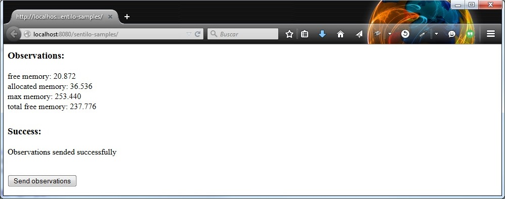

Java Client Tutorial
====================

.. figure:: /_static/images/tutorials/java_logo.jpg
   :alt: Java

The Sentilo Java Client is a library developed for working with webapps
or standalone java applications. You can download an example of a client from
https://github.com/sentilo/sentilo-client-sample-java.

For this example, we’ll use a basic maven based web application, that
retrieve some system data and send it as a sensor observation to the
Sentilo Platform. This webapp is named **sentilo-client-java-sample**
and you’ll find it into the source code (see above).

Hardware
--------

We don’t need any specific hardware for running this example, only one
PC with Internet connection.

Software
--------

You’ll need some software packages, as you’re developing in Java
environment:

-  Java SE 1.8
-  Eclipse IDE or STS Spring IDE
-  The **Sentilo Client Java Library**, which you can download and
   install it as a *Maven dependency* into your project (please, see the
   **pom file** in the project form more information)
-  Tomcat 7+
-  If you don't have access to a working Sentilo instance, you might as well use our ` Sentilo VM </use_a_virtual_machine.html>`__.

The example
-----------

The code
~~~~~~~~

Please download this sample webapp project from Git repository:
https://github.com/sentilo/sentilo-client-sample-java

Once you have the project, open it with Eclipse or another IDE and
construct it using *Maven* goals: **clean package**, for downloading
dependencies, compile the code and package it.

After your project is compiled and packaged, you can deploy it in a
Tomcat webapp container (standalone or the one your IDE provides).

.. note::

   In case you use our VM on the same machine as Tomcat of this example, you might have a problem with port 8080 already being used.
   That's because Virtualbox will NAT the VM's Tomcat on 8080 to port 8080 on your host machine. If it's your case,
   you should change the port of your Tomcat to, for example, 8888.

Now you can then navigate into the project and edit the source code.

The properties file
^^^^^^^^^^^^^^^^^^^

You must modify the properties file :literal:`application.properties` located
in :literal:`src/main/resources/properties` in order to provide your correct
Sentilo Platform Client configurations.

.. code:: properties

   # Sentilo Platform API Services IP
   rest.client.host=YOUR_SENTILO_PLATFORM_CLIENT_ADDRESS

   # User configurations
   rest.client.identityKey=YOUR_IDENTITY_KEY
   rest.client.provider=samples-provider
   rest.client.component=sample-component
   rest.client.component.type=generic
   rest.client.component.location=41.387015 2.170047
   rest.client.sensor=sample-sensor-java
   rest.client.sensor.type=status
   rest.client.sensor.dataType=TEXT
   rest.client.sensor.location=41.387015 2.170047

This settings should be updated:

-  **rest.client.host**: provide a correct host or ip address of your
   Sentilo Platform Client, and replace the
   *YOUR_SENTILO_PLATFORM_CLIENT_ADDRESS* with it. Needs the protocol and the port. Ex: http://localhost:8081
-  **rest.client.identityKey**: provide your correct application
   security token, and replace the *YOUR_IDENTITY_KEY* with it
-  *optionally* **rest.client.sensor.type**: you can select a default type (anemometer, humidity, noise... etc) in the catalog or you can create one of your election there.
-  *optionally*, you can provide your component / sensor locations,
   modifying the values **rest.client.component.location** and
   **rest.client.sensor.location**

The samples controller
^^^^^^^^^^^^^^^^^^^^^^

There’s a Spring MVC controller which displays a view with the sensor
data retrieved from system and the publish result. Navigate to
**src/main/java** and open this resource
**org.sentilo.samples.controller.SamplesController**.

This is a Spring Framework Controller that creates a view where you’ll
see a sample data value obtained from the System, and then send it as
observation to your Sentilo Platform instance. The webapp is based on
Maven & Spring foundations, so you must modify and provide some
configurations before start the example execution (see above).

.. code:: java

    @Controller
    public class SamplesController {

        private final Logger logger = LoggerFactory.getLogger(SamplesController.class);

        private static final String VIEW_SAMPLES_RESPONSE = "samples";

        @Autowired
        private PlatformTemplate platformTemplate;

        @Resource
        private Properties samplesProperties;

        @RequestMapping(value = {"/", "/home"})
        public String runSamples(final Model model) {

            // All this data must be created in the Catalog Application before start this
            // sample execution. At least the application identity token id and the provider id must be
            // declared in system twice
            String restClientIdentityKey = samplesProperties.getProperty("rest.client.identityKey");
            String providerId = samplesProperties.getProperty("rest.client.provider");

            // For this example we have created a generic component with a status sensor that accepts text
            // type observations, only for test purpose
            String componentId = samplesProperties.getProperty("rest.client.component");
            String sensorId = samplesProperties.getProperty("rest.client.sensor");

            logger.info("Starting samples execution...");

            String observationsValue = null;
            String errorMessage = null;

            try {
                // Get some system data from runtime
                Runtime runtime = Runtime.getRuntime();
                NumberFormat format = NumberFormat.getInstance();
                StringBuilder sb = new StringBuilder();
                long maxMemory = runtime.maxMemory();
                long allocatedMemory = runtime.totalMemory();
                long freeMemory = runtime.freeMemory();

                sb.append("free memory: " + format.format(freeMemory / 1024) + " ");
                sb.append("allocated memory: " + format.format(allocatedMemory / 1024) + " ");
                sb.append("max memory: " + format.format(maxMemory / 1024) + " ");
                sb.append("total free memory: " + format.format((freeMemory + (maxMemory - allocatedMemory)) / 1024) + " ");

                // In this case, we're getting CPU status in text mode
                observationsValue = sb.toString();

                logger.info("Observations values: " + observationsValue);

                // Create the sample sensor, only if it doesn't exists in the catalog
                createSensorIfNotExists(restClientIdentityKey, providerId, componentId, sensorId);

                // Publish observations to the sample sensor
                sendObservations(restClientIdentityKey, providerId, componentId, sensorId, observationsValue);
            } catch (Exception e) {
                logger.error("Error publishing sensor observations: " + e.getMessage(), e);
                errorMessage = e.getMessage();
            }

            logger.info("Samples execution ended!");

            model.addAttribute("restClientIdentityKey", restClientIdentityKey);
            model.addAttribute("providerId", providerId);
            model.addAttribute("componentId", componentId);
            model.addAttribute("sensorId", sensorId);
            model.addAttribute("observations", observationsValue);

            ObjectMapper mapper = new ObjectMapper();

            try {
                if (errorMessage != null && errorMessage.length() > 0) {
                    Object json = mapper.readValue(errorMessage, Object.class);
                    model.addAttribute("errorMsg", mapper.writerWithDefaultPrettyPrinter().writeValueAsString(json));
                } else {
                    model.addAttribute("successMsg", "Observations sent successfully");
                }
            } catch (Exception e) {
                logger.error("Error parsing JSON: {}", e.getMessage(), e);
                errorMessage += (errorMessage.length() > 0) ? " " : "" + e.getMessage();
                model.addAttribute("errorMsg", errorMessage);
            }

            return VIEW_SAMPLES_RESPONSE;
        }

        /**
         * Retrieve catalog information about the sample provider. If the component and/or sensor doesn't
         * exists, then let create they
         *
         * @param identityToken Samples Application identity token for manage the rest connections
         * @param providerId    Samples provider id
         * @param componentId   Samples component id
         * @param sensorId      Samples sensor id
         * @return {@link CatalogOutputMessage} object with provider's catalog data
         */
        private CatalogOutputMessage createSensorIfNotExists(String identityToken, String providerId, String componentId, String sensorId) {
            List<String> sensorsIdList = new ArrayList<String>();
            sensorsIdList.add(sensorId);

            // Create a CatalogInputMessage object for retrieve server data
            CatalogInputMessage getSensorsInputMsg = new CatalogInputMessage();
            getSensorsInputMsg.setProviderId(providerId);
            getSensorsInputMsg.setIdentityToken(identityToken);
            getSensorsInputMsg.setSensors(createSensorsList(providerId, componentId, sensorsIdList));

            // Obtain the sensors list from provider within a CatalogOutputMessage response object type
            CatalogOutputMessage getSensorsOutputMsg = platformTemplate.getCatalogOps().getSensors(getSensorsInputMsg);

            // Search for the sensor in the list
            boolean existsSensor = false;
            if (getSensorsOutputMsg.getProviders() != null && !getSensorsOutputMsg.getProviders().isEmpty()) {
                for (AuthorizedProvider provider : getSensorsOutputMsg.getProviders()) {
                    if (provider.getSensors() != null && !provider.getSensors().isEmpty()) {
                        for (CatalogSensor sensor : provider.getSensors()) {
                            logger.debug("Retrieved sensor: " + sensor.getComponent() + " - " + sensor.getSensor());
                            existsSensor |= sensorId.equals(sensor.getSensor());
                            if (existsSensor) {
                                break;
                            }
                        }
                    }
                }
            }

            // If the sensor doesn't exists in the retrieved list, we must create it before publish the
            // observations
            if (!existsSensor) {
                // Create a CatalogInputMessage object for retrieve server data
                CatalogInputMessage registerSensorsInputMsg = new CatalogInputMessage(providerId);
                registerSensorsInputMsg.setIdentityToken(identityToken);
                registerSensorsInputMsg.setSensors(createSensorsList(providerId, componentId, sensorsIdList));

                // Register the new sensor in the server
                platformTemplate.getCatalogOps().registerSensors(registerSensorsInputMsg);
            }

            return getSensorsOutputMsg;
        }

        /**
         * Publish some observations from a sensor
         *
         * @param identityToken Samples Application identity token for manage the rest connections
         * @param providerId    Samples provider id
         * @param componentId   Samples component id
         * @param sensorId      Samples sensor id
         * @param value         Observations value, in our case, a String type
         */
        private void sendObservations(String identityToken, String providerId, String componentId, String sensorId, String value) {
            List<String> sensorsIdList = new ArrayList<String>();
            sensorsIdList.add(sensorId);
            createSensorsList(providerId, componentId, sensorsIdList);

            List<Observation> observations = new ArrayList<Observation>();
            Observation observation = new Observation(value, new Date());
            observations.add(observation);

            SensorObservations sensorObservations = new SensorObservations(sensorId);
            sensorObservations.setObservations(observations);

            DataInputMessage dataInputMessage = new DataInputMessage(providerId, sensorId);
            dataInputMessage.setIdentityToken(identityToken);
            dataInputMessage.setSensorObservations(sensorObservations);

            platformTemplate.getDataOps().sendObservations(dataInputMessage);
        }

        /**
         * Create a component list
         *
         * @param componentId Component identifier
         * @return A {@link CatalogComponent} list
         */
        private List<CatalogComponent> createComponentsList(String componentId) {
            List<CatalogComponent> catalogComponentList = new ArrayList<CatalogComponent>();
            CatalogComponent catalogComponent = new CatalogComponent();
            catalogComponent.setComponent(componentId);
            catalogComponent.setComponentType(samplesProperties.getProperty("rest.client.component.type"));
            catalogComponent.setLocation(samplesProperties.getProperty("rest.client.component.location"));
            catalogComponentList.add(catalogComponent);
            return catalogComponentList;
        }

        /**
         * Create a sensor list
         *
         * @param componentId   The Sample Component Id
         * @param sensorsIdList A list with the sensor ids to create
         * @return A {@link CatalogSensor} list
         */
        private List<CatalogSensor> createSensorsList(String providerId, String componentId, List<String> sensorsIdList) {
            List<CatalogSensor> catalogSensorsList = new ArrayList<CatalogSensor>();
            for (String sensorId : sensorsIdList) {
                CatalogSensor catalogSensor = new CatalogSensor();
                catalogSensor.setComponent(componentId);
                catalogSensor.setSensor(sensorId);
                catalogSensor.setProvider(providerId);
                catalogSensor.setType(samplesProperties.getProperty("rest.client.sensor.type"));
                catalogSensor.setDataType(samplesProperties.getProperty("rest.client.sensor.dataType"));
                catalogSensor.setLocation(samplesProperties.getProperty("rest.client.sensor.location"));
                catalogSensorsList.add(catalogSensor);
            }
            return catalogSensorsList;
        }
    }

What’s happenning?

-  First of all, we’re looking for some configuration settings, like the
   component and sensor names
-  Next, we’re using some runtime status values, so we can the publish
   them as a observations (mem status, for example)
-  First of all, we check if the sensor has been created before in the
   Catalog, and if it doesn't exists we add it
-  After that, we’ll publish the sensor observations
-  Then, we pass all this information to the view for displaying it the
   navigator window

This is an observation sample:

::

   CPU states: 5.8% user, 1.9% system, 0.0% nice, 0.0% wait, 91.7% idle

The samples page view
^^^^^^^^^^^^^^^^^^^^^

And finally, this is the source code of the view:

.. code:: jsp

   <%@ taglib prefix="c" uri="http://java.sun.com/jsp/jstl/core" %>
   <%@ page contentType="text/html; charset=UTF-8" pageEncoding="UTF-8"%>
   <!DOCTYPE html>

   <html>

    <head>
     
    </head>

    <body>
     
     <h3>Observations:</h3>
     
${observations}

      

     <c:if test="${not empty successMsg}">
      <h3>Success:</h3>
      
${successMsg}

     </c:if>

     <c:if test="${not empty errorMsg}">
      <h3>Error:</h3>
      <pre>${errorMsg}</pre>
     </c:if>
     
      
     
     <button onclick="location.reload();">Send observations</button>
     
    </body>

   </html>

This source code is quite easy, so don’t need to comment it.

Executing the sample application
~~~~~~~~~~~~~~~~~~~~~~~~~~~~~~~~

Using the IDE or copying the WAR file, deploy your webbapp into
the Tomcat deployments directory, and start it.

You must access to this url (we assume that you’re in your localhost and
your port is the 8080, the default values):
http://localhost:8080/sentilo-samples (http://localhost:8888/sentilo-samples if using VM )

And then you must see a result page like this:

|java_sample_4.jpg|

As you can see, there’s a button named *Send observations*. You can use
to re-send observations and reload the page. Every page reload send the
observations to the Sentilo Platform Client.

