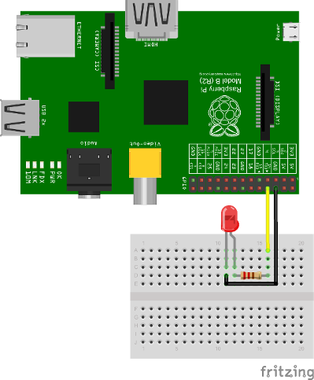

RaspberryPi Client
==================

.. figure:: /_static/images/tutorials/raspberrypi.jpeg
   :alt: RaspberryPi

The **SentiloClientNodeJS** is a library written in javascript that
brings to you the possibility to connect any device and embedded device
with Node.js to a Sentilo instance easily.

For this example we'll use a Raspberry pi device, because its special
features, like cheap price, small dimensions and the great input-output
possibilities.

Hardware
--------

We need some hardware to execute this example:

+-----------------------------------+-----------------------------------+
| Material                          | Description                       |
+-----------------------------------+-----------------------------------+
| **Raspberry Pi**                  | Of course, we need a Raspberry    |
|                                   | Pi, doesn't matters its version.  |
|                                   | You need a Raspbian distro        |
|                                   | installed too                     |
+-----------------------------------+-----------------------------------+
| **Ethernet cable or wifi dongle** | Doesn't matter what network       |
|                                   | hardware do you use, it's up to   |
|                                   | you, but you'll need the correct  |
|                                   | drivers correctly configured for  |
|                                   | connecting to Internet            |
+-----------------------------------+-----------------------------------+
| **Some cables**                   | Some "dupont" male-to-female      |
|                                   | cables to make breadboard         |
|                                   | connections                       |
+-----------------------------------+-----------------------------------+
| **A LED**                         | We'll use a LED as an output for  |
|                                   | simulating order execution, you   |
|                                   | can pick any color                |
+-----------------------------------+-----------------------------------+
| **A resistor**                    | A 470 Ohms 1/4W resistance        |
+-----------------------------------+-----------------------------------+
| **A breadboard**                  | You'll need an electronic         |
|                                   | connections base to make some     |
|                                   | circuits, so we'll recommend you  |
|                                   | to get a breadboard               |
+-----------------------------------+-----------------------------------+

Software
--------

We need to install some node.js alternative modules or libraries. We'll
install them through *npm* or download them from the Internet. See the
next section for more information.

Setup the Raspi
---------------

In this example we'll show to you how to implement a sensor and a
actuator with several capabilities such as:

-  get values from one o more sensors connected to it GPIO port and
   publish them in Sentilo
-  receive orders from a Sentilo application and actuate on the GPIO in
   consequence

If you don't have node.js installed, install it with:

::

   sudo apt-get install nodejs
   sudo apt-get install npm

The software
~~~~~~~~~~~~

Create the workspace
^^^^^^^^^^^^^^^^^^^^

First of all, create a directory named **sentilo** (for example) in our
user home and change to it:

::

   pi@raspberrypi ~ $ mkdir sentilo && cd sentilo

Here we'll work with all our files.

Install the sample code and its dependencies
^^^^^^^^^^^^^^^^^^^^^^^^^^^^^^^^^^^^^^^^^^^^

Download the sample project for this tutorial from the `Sentilo git repository <https://github.com/sentilo>`__, and clone it into your
working directory:

::

   pi@raspberrypi ~/sentilo $ git clone https://github.com/sentilo/sentilo-client-sample-nodejs

We need some Node.js modules to work with our library. So you need to
download and install the through *npm*.

You can download via npm update:

::

   pi@raspberrypi ~/sentilo/sentilo-client-sample-nodejs $ npm install

Or install them directly:

::

   pi@raspberrypi ~/sentilo/sentilo-client-nodejs $ npm install express
   pi@raspberrypi ~/sentilo/sentilo-client-nodejs $ npm install sync-request
   pi@raspberrypi ~/sentilo/sentilo-client-nodejs $ npm install onoff

Which dependencies have been installed?

-  **sentilo-client-nodejs**: it is a client library for Sentilo (`see its main GiHub page
   <https://github.com/sentilo/sentilo-client-nodejs>`__ or the `NPM library page <https://www.npmjs.com/package/sentilo-client-nodejs>`__ for more information)
-  **express**: it is a rest server interface for Node.js that allow to us
   to create a rest server easily (`see this
   link <https://www.npmjs.com/package/express>`__ for more information)
-  **sync-request**: allow to us to create synchronous http calls (`see
   this link <https://www.npmjs.com/package/sync-request>`__ for more
   information)
-  **onoff**: it is a GPIO driver that allow to us to turn on and off a LED
   very easily! (`see this
   link <https://www.npmjs.com/package/tm-onoff>`__ for more
   information)

Now, we can start to develop with node in our working directory

Connecting the hardware
~~~~~~~~~~~~~~~~~~~~~~~

We'll assume that you have your Raspberry Pi connected to the Internet,
a Raspbian system correctly installed and enough permissions to create
and runs scripts in your user home. Usually, we will use the **pi**
user.

To simulate a sensor's actuator, we'll use a LED connected to the GPIO
14 from the Raspberry Pi.

Let see it below:

|raspi3.png|

As you can see, we only connect the **LED** **annode** to the **14
GPIO** pin, and the **kathode** to the **GND** pin. We're ready to turn
ON and OFF this LED from the Sentilo platform.

The example
-----------

Our example is a complete test of the Sentilo Client Node.js library.

The library allows you to perform these operations:

-  Catalog

   -  Get sensors from a provider
   -  Register sensors for a provider
   -  Update sensors configuration
   -  Register alerts

-  Alarm

   -  Publish alarms

-  Data

   -  Retrieve last observations from a sensor
   -  Publish observations

-  Subscription

   -  Subscribe orders from a sensor
   -  Subscribe orders for all the sensors of a provider

The code
~~~~~~~~

actuator.js
^^^^^^^^^^^

This file contains code to control the output LED, that performs a
simulation of a possible actuator controlled by the Raspberry Pi and
orders published on the Sentilo platform. In the example, the system is
being subscribed as endpoint to receive incoming order actuation calls.

.. code:: javascript

   var Gpio = require('onoff').Gpio;
   var led;

   module.exports = {

       init : function() {
            // Configure the GPIO as OUTPUT
            led = new Gpio(14, 'out');

            console.log('Turning OFF the LED');

            // Turn off the LED on startup
            led.writeSync(0);
        },

        /**
         * Execute an order in the actuator. For this example, we've mounted a LED
         * in GPIO 14, where we can turn it ON (order=ON) or OFF (order=OFF)
         *
         * @param order
         *            A Sentilo order object structure
         */
        executeOrder : function(order) {
            console.log('Executing order: ' + order.message);

            if (order.message === 'ON') {
                console.log('Turning ON the LED');
                led.writeSync(1);
            } else if (order.message === 'OFF') {
                console.log('Turning OFF the LED');
                led.writeSync(0);
            }

        }

   };

What's happening here?

-  The **init** function configures the GPIO 14 as an output to control
   the LED (don't forget to call it!)
-  The **executeOrder** function performs the actuator order execution,
   for our case, it turns the LED ON and OFF if the order was either ON or
   OFF. The main server code will access this function.

sensor.js
^^^^^^^^^

This file contains the code that performs a possible sensor data read
and return its value. For our example, we only emulate a random value as
a possible sensor data value. You may develop an data input sensor with
a GPIO library.

.. code:: javascript

   module.exports = {

        readSensorValue : function() {

            var sensorValue = Math.floor((Math.random() * 255));
            return sensorValue;
        }

   };

What's happening here?

-  The **readSensorValue** function reads a possible sensor input data
   value from an external way. The main server code will access to this
   function to read the sensor data.

*NOTE: as you see, you must implement this function to complete your
requirements*

server.js
^^^^^^^^^

This is the main node file. This file performs a rest server and still
waiting for incoming calls that apply to the actuator.

.. code:: javascript

   // The OS information module
   var os = require('os');
   
   // Include some Sentilo operations from the Nodejs client library
   var sentilo = require('sentilo-client-nodejs');
   
   // Module that interacts with the local sensor
   var sensor = require('./sensor.js');
   
   // Module that interacts with the local actuator
   var actuator = require('./actuator.js');
   actuator.init();
   
   // Get some OS values, like the sensor IP
   var interfaces = os.networkInterfaces();
   var addresses = [];
   for (var k in interfaces) {
       for (var k2 in interfaces[k]) {
           var address = interfaces[k][k2];
           if (address.family === 'IPv4' && !address.internal) {
               addresses.push(address.address);
           }
       }
   }
   var myIp = addresses[0];
   var myPort = 3000;
   var myEndpoint = 'http://'+myIp+':'+myPort;
   var myOrderEndointPath = '/order'; 
   var myOrderEndoint = myEndpoint + myOrderEndointPath;
   var systemObservationsTimeout = 60000;
    
   // Service and example options
   // You must modify it under your requeriments
   var samplesOptions = {
       host : 'YOUR-SENTILO-INSTANCE-HOST-IP',
       port : 'YOUR-SENTILO-INSTANCE-HOST-PORT',
       headers : {
           identity_key : 'YOUR_SENTILO-INSTANCE-DEFAULT-IDENTITY-KEY'
       },
       tokenId : 'YOUR-SENTILO-INSTANCE-IDENTITY-KEY',
       providerTokenId : 'YOUR-SENTILO-INSTANCE-PROVIDER-IDENTITY-KEY',
       provider : 'samples-provider',
       sensor : 'sample-sensor-nodejs',
       component : 'sample-component',
       componentType : 'generic',
       sensorDataType : 'TEXT',
       sensorType : 'status',
       sensorUnit : '',
       sensorLocation : '41.4122494 2.2101553'
   };
    
   // A very simple RESTFul server module
   var express = require('express');
   var server = express();
   server.use(express.json()) // for parsing application/json
   server.use(express.urlencoded({ extended: true })) // for parsing application/x-www-form-urlencoded
   
   server.get('/', (req, res) => {
   	var output = `
Test server is listening at port: ${myPort}
`;
   	output += `
The server is now ready to receive POST incoming callsat: ${myOrderEndoint}
`;
     	res.send(output);
   });
   
   // We only need a POST endpoint service to receive ordercs callbacks
   // The path will be [POST] http://localhost:3000/order
   server.post('/order', function(req, res, next) {
   	var order = req.body;
   	console.info("[server][POST] Order received: " + JSON.stringify(order));
       
   	res.json(req.body);
   	
       // Execute the order in the actuator
       actuator.executeOrder(req.body);
   
       var value = 'Order received and executed: ' + JSON.stringify(order.message);
       sentilo.publishObservations(value, samplesOptions);
   
       return next();
   });
   
   function sentiloInit() {
   	console.log('[server][sentilo-init] Initializing the NodeJS client example for Sentilo');
   	
   	// Init Sentilo services for this example
   	// Here you must pass as paramether the specific configuration
   	sentilo.init(samplesOptions);
   	
   	// Test if is there the sensor configured in the catalog
   	console.log(`[server][sentilo-init] Registering the ${samplesOptions.sensor} sensor...`);
   	var existsSensor = sentilo.existsSensorInCatalog(samplesOptions);
   	if (!existsSensor) {
   	    // If not, then create it
   	    sentilo.createSensor(samplesOptions);
   	    console.log(`[server][sentilo-init] Sensor ${samplesOptions.sensor} successfully created`);
   	} else {
   		console.log(`[server][sentilo-init] Sensor ${samplesOptions.sensor} already exists, we'll use it`);
   	}
   	
   	// Now we can publish a first alarm that informs that the sensor is up
   	// First of all let create an external alert
   	console.log('[server][sentilo-init] Registering the System Status Alert...');
   	var alertsListInputMessage = {
   	    alerts : [ {
   	        id : 'SYSTEM_STATUS_ALERT',
   	        name : 'SYSTEM_STATUS_ALERT',
   	        description : 'Custom alert to inform the system status',
   	        type : 'EXTERNAL'
   	    } ]
   	};
   	sentilo.createAlerts(alertsListInputMessage);
   	
   	// And then, we can publish an alarm to inform that the system is up now
   	var alarmInputMessage = {
   	    message : 'The system goes up on ' + new Date()
   	};
   	sentilo.publishAlarm('SYSTEM_STATUS_ALERT', alarmInputMessage);
   	console.log('[server][sentilo-init] Alarm published: ' + alarmInputMessage.message);
   	
   	// Subscribe the sensor orders
   	// We'll manage it throught our server on POST service
   	var subscriptionInputMessage = {
   	    endpoint : myOrderEndoint
   	};
   	sentilo.subscribeOrder(subscriptionInputMessage);
   	// sentilo.subscribeOrderToAll(subscriptionInputMessage);
   	console.log('[server][sentilo-init] Sensor\'s orders succsessfully subscribed to this server');
   	
   	// Now, we can publish observations every 60 seconds
   	// And still waiting for incoming orders
   	publishTestData();
   }
   
   function publishTestData() {
   	console.log('[server][publishTestdata] The sensor is now up, and we\'ll be sending some observations every ' + systemObservationsTimeout + ' ms');
   	setInterval(function() {
   	    // Send some System information
   	    var freeMemValue = "OS freemem: " + os.freemem();
   	    console.log('[server][publishTestdata] Retrieved system freemem value: [' + freeMemValue + '] and publishing it as an observation...');
   	    sentilo.publishObservations(freeMemValue, samplesOptions);
   	
   	    // Retrieve some sensor data and send it as observation...
   	    var sensorDataValue = "Sensor value: " + sensor.readSensorValue();
   	    console.log('[server][publishTestdata] Retrieved sensor value: [' + sensorDataValue + '] and publishing it as an observation...');
   	    sentilo.publishObservations(sensorDataValue, samplesOptions);
   	}, systemObservationsTimeout);
   }
   
   server.listen(myPort, () => {
     	console.log(`[server] My ip address is: ${myIp}`);
     	console.log(`[server] Test server is listening at: ${myEndpoint}`);
   	console.log(`[server] The server is now ready to receive POST incoming calls at: ${myOrderEndoint}`);
   	
   	// Initialize the example
   	sentiloInit();
   })

First of all, we'll see the configuration options (line 62). They must be changed
before run this example.

You must provide the correct values for these variables located into the
**samplesOptions** object:

-  **YOUR-SENTILO-INSTANCE-HOST-IP** & **YOUR-SENTILO-INSTANCE-HOST-PORT**: 
   provide the correct **ip address** or host of your Sentilo's instance rest server and port
-  **YOUR_SENTILO-INSTANCE-DEFAULT-IDENTITY-KEY**: you must provide your **private security key**
   *(tokenId)* that identifies your **application** or **provider** (normally same as **YOUR-SENTILO-INSTANCE-IDENTITY-KEY**).
   If it is an application, it must have ADMIN permissions over your provider.
-  **YOUR_SENSOR_LOCATION**: this is optional, identifies the component
   location of the sample sensor. It can be for example :literal:`'41.387015 2.170047'`

Now, what's happens in this code?

-  First, we start a **rest server** with the *express*
   module, that allows to us to provide an endpoint for incoming order
   calls (POST method). After that, we create a subscription for our
   orders.
-  When a POST request is received, the server will invoke the **actuator's
   executeOrder function**, so we can manage the order correctly (turn
   ON/OFF the LED, for example)
-  Initialize the **sentilo's helper module** (as you can see above),
   implemented by the *sentilo.js* file
-  We're passing to it our specific services configuration, like the
   sensor id, provider's token, etc…
-  Request for the sensor in the Sentilo Catalog platform, and if it
   doesnt't exists, create it
-  Once we have created the sensor, we're creating an alert, named
   **SYSTEM_STATUS_ALERT**, and publishing an initial alarm that says
   **The system goes up on {date}**. Then, the sensor is up and we're
   informing it to the system
-  After that, retrieve some system and sensor data values and publish
   them every 60000ms (1 minute) in a infinite loop

Executing the example
~~~~~~~~~~~~~~~~~~~~~

Now we can finally execute the example.

Simple type:

::

   pi@raspberrypi ~/sentilo/sentilo-client-nodejs $ node server.js
   [actuator] Turning OFF the LED
   [server] My ip address is: 127.0.0.1
   [server] Test server is listening at: http://127.0.0.1:3000
   [server] The server is now ready to receive POST incoming calls at: http://127.0.0.1:3000/order
   [server][sentilo-init] Initializing the NodeJS client example for Sentilo
   [server][sentilo-init] Registering the sample-sensor-nodejs sensor...
   [server][sentilo-init] Sensor sample-sensor-nodejs successfully created
   [server][sentilo-init] Registering the System Status Alert...
   [server][sentilo-init] Alarm published: The system goes up on Mon Nov 21 2022 16:56:32 GMT+0100 (hora estándar de Europa central)
   [server][sentilo-init] Sensor's orders succsessfully subscribed to this server
   [server][publishTestdata] The sensor is now up, and we'll be sending some observations every 60000 ms

And now, the server is waiting for publish the observations every 60
seconds:

::

   [server][publishTestdata] Retrieved system freemem value: [OS freemem: 2927603712] and publishing it as an observation...
   [server][publishTestdata] Retrieved sensor value: [Sensor value: 51] and publishing it as an observation...

Publishing and accepting orders
^^^^^^^^^^^^^^^^^^^^^^^^^^^^^^^

The server also is writing for incoming POST calls that responses the
ORDER requests. You can practice with orders, sending a PUT message to
the Sentilo platform, some like this:

::

   http://sentilo_platform_ip:8081/order/samples-provider/sample-sensor-nodejs

With these values:

::

   HEADER > identity_key : 'YOUR_IDENTITY_KEY'
   BODY   > {"order" : "ON"}  > this turns ON the LED
   BODY   > {"order" : "OFF"} > this turns OFF the LED

After that, you'll see in the console some log like this when you're
turning the LED ON, sending **order = ON**:

::

   [POST] Order received: {"message":"ON","timestamp":"07/05/2015T13:58:20","topic":"/order/samples-provider/sample-sensor-nodejs","type":"ORDER","sensor":"sample-sensor-nodejs","provider":"samples-provider","sender":"samples-provider","time":1431007100595}
   Executing order: ON
   Turning ON the LED

Or turning it OFF, with **order = OFF**:

::

   [POST] Order received: {"message":"OFF","timestamp":"07/05/2015T14:01:13","topic":"/order/samples-provider/sample-sensor-nodejs","type":"ORDER","sensor":"sample-sensor-nodejs","provider":"samples-provider","sender":"samples-provider","time":1431007273310}
   Executing order: OFF
   Turning OFF the LED

Debugging the library
^^^^^^^^^^^^^^^^^^^^^

If you need to debug your execution, you can edit the file
:literal:`node_modules/sentilo-client-nodejs/src/utils/SentiloLogs.js` and edit the logs configuration
properties, as you need:

::

   var options = {
       className : 'Sentilo',
       enableLogs : true,
       enableDebug : true,
       enableInfo : true,
       enableWarn : true,
       enableError : true,
       enableFatal : true
   };

For our purpose, we only have DEBUG, INFO and ERROR logs. Try tu use
**true** or **false** for each one.

